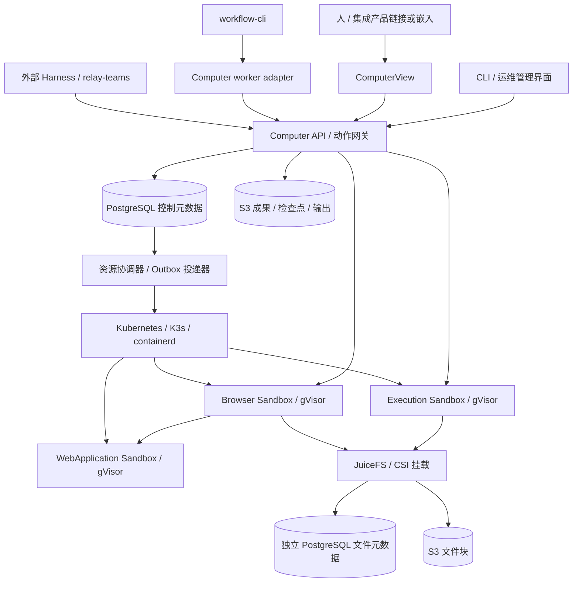
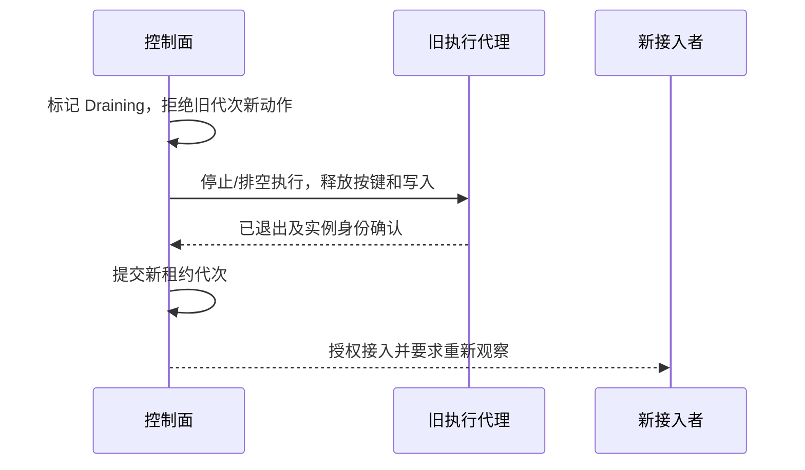
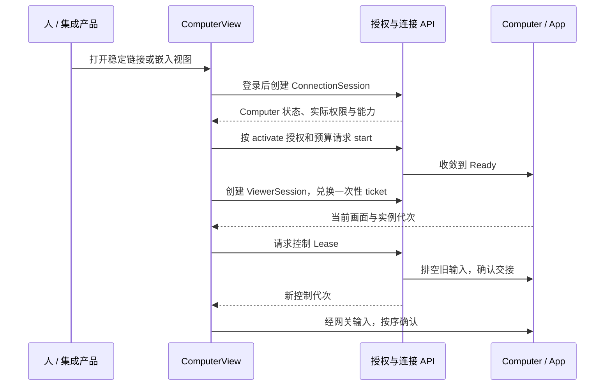

# agent-computer 详细技术设计

版本：设计基线 0.4；日期：2026-10-09；状态：待实现。

本文落实[产品需求 R01–R32](../requirements/agent-computer.md)，R32 是后续可选评测扩展。所有协议、命令和配置例子均为设计契约；当前仓库没有实现这些接口。实现验收见[测试矩阵](../test/agent-computer.md)，CLI 责任与证据见[生态集成](ecosystem-integration.md)。0.4 的场景依据见[superpod 对照](../requirements/agentic-scenarios-and-gaps.md)，D16/D17 分别索引部署与 Agentic 运行契约。

## D01. 架构与技术决策

计算与存储先按需求/硬约束、同层候选和完整组合比较，再形成以下参考选择。完整依据见[多维度选型分析 CS01–CS10](../decisions/compute-storage-selection.md)，包括调度、隔离、控制数据库、工作文件、对象存储实现、活动状态、成本、成熟度、采用条件和待执行实验。下表和架构图展示待认证参考组合，不替代比较；这些方案均未完成本项目组合实测。



首版采用模块化控制服务加独立运行 worker，不把每个逻辑对象拆成微服务。API、协调器、事件投递器共享 Computer 控制数据库；Browser Driver 和执行代理通过内部受认证通道提供能力。workflow、knowledge、memory 均是外部产品。

协调器、授权网关与结果提交器属于可信控制面；用户命令不能在其身份下运行。沙箱内助手仅采集进程/页面结果，不持有控制数据库、集群或全桶密钥。可信运行适配器在沙箱外绑定请求和回执，再执行代次检查与状态提交。应用报告的输出仍是待验证数据，不能让沙箱自行签发业务成功或扩大权限。

| 决策 | 选择 | 取舍与边界 |
| --- | --- | --- |
| ADR-01 控制面 | Rust、Tokio、Axum、SQLx/PostgreSQL | 领域状态机无 Kubernetes/浏览器 SDK 依赖；存储与适配器位于边界 |
| ADR-02 调度 | Kubernetes API；优先复用合格现有/托管集群，自建参考 K3s | 对比 Compose/自建 worker、Nomad、现成 Sandbox 平台后选择，减少自研调度；CS02、CS07、DP01 |
| ADR-03 隔离 | containerd + gVisor runsc RuntimeClass，默认 Systrap | 对比 runc、Kata、Firecracker、完整 VM；权衡宿主要求/隔离/兼容与 I/O 代价；不支持时拒绝，不降级；CS02、CS07 |
| ADR-04 浏览器 | Chromium + Node.js/TypeScript Playwright Driver | 结构化定位与截图坐标操作同一入口；无需修改 Chromium 内核 |
| ADR-05 控制数据 | PostgreSQL | 对比 MySQL、SQLite、etcd；事务/查询匹配产品状态，HA 另需同步确认与正确切换；CS03 |
| ADR-06 工作文件 | 共享目录参考：JuiceFS CE + 独立 PostgreSQL 元数据库 + S3 文件块 | 对比 CephFS、HA NFS、块卷、本地同步、s3fs、AgentFS；已有 Ceph/NAS 优先比较复用，任何替代须同等认证；CS04、CS10 |
| ADR-07 成果 | 独立 S3 对象 + PostgreSQL 清单；优先复用合格 S3 | 对比共享 FS/数据库大对象及 S3 实现；新建私有参考候选 SeaweedFS，已有 Ceph 优先 RGW，均需验收；CS05 |
| ADR-08 事件 | PostgreSQL 持久事件 + Outbox + SSE | 首版不引入 Kafka/Redis；NOTIFY 仅作唤醒优化，不能代替事件记录 |
| ADR-09 恢复 | 文件/应用检查点重建，活动 profile 本地独占 | 对比内存快照、独占块卷和共享目录；接受最近检查点 RPO，首版不承诺进程迁移；CS02、CS06 |
| ADR-10 生态 | 版本化 API/CLI 适配，独立发布 | 不直接依赖外部仓库内部 crate 或数据库表 |
| ADR-11 人的入口 | TypeScript/React ComputerView，独立链接与受控嵌入共用组件 | 统一 ConnectionSession/ViewerSession 授权；运维界面不承担日常使用入口 |
| ADR-12 可运行成果 | ArtifactVersion + Presentation + AppInstance，远程 Chromium 呈现 | 生成应用代码在隔离 Sandbox 内执行；不在集成产品的页面 origin 中执行生成脚本 |

K3s 的单节点与 HA 拓扑、gVisor 的 Kubernetes/containerd 接入和 JuiceFS 的分离存储/CSI 能力均有官方说明。选型是工程决策，不证明这一组合已经测试：[K3s](https://docs.k3s.io/architecture)、[gVisor](https://gvisor.dev/docs/user_guide/quick_start/kubernetes/)、[JuiceFS 架构](https://juicefs.com/docs/community/architecture/)。

## D02. 领域对象与身份

所有对象有不可复用 ID、服务端推导的 `organization_id`、创建/修改时间和整数 `revision`。显示名称可以改变，ID 不随重建改变。`revision` 用于元数据并发控制，`generation` 用于隔离旧执行实例，两者不能互换。

| 对象 | 核心字段 | 生命周期/约束 |
| --- | --- | --- |
| Computer | workspace_ref、sandbox_refs、app_refs、desired_state、observed_state、generation | 是逻辑聚合；一个 Computer 可同时组合 Browser 和执行 Sandbox |
| Volume | storage_class、scope、quota、retention、backend_ref | 不随 Sandbox 删除；实际凭据由存储控制面管理 |
| Workspace | volume_ref、members、policy_revision、current_manifest、quota | 长期协作范围，可被多台 Computer 授权访问 |
| SandboxSpec/Instance | image_digest、resources、network_policy、mounts / pod_uid、generation、state | 定义不可变版本；实例引用固定版本，Pod UID 不能充当稳定产品 ID |
| AppSpec/Instance | driver、sandbox_ref、state_paths、health / checkpoint_ref、state、presentation_ref、owner_principal_id | 首版 Browser/WebApplication；运行复用 D04 状态机，实例可归属某次个人成果试用 |
| AgentSpec | adapter、version、image/endpoint、skills_lock、capabilities、secret_refs | `external` 接入或 `hosted` 实例化；不保存模型历史 |
| Principal | id、kind=human/agent、identity_ref、organization_id | 服务端根据组织身份或服务凭据确定；请求体不能代选主体 |
| ConnectionSession | principal_id、computer_id、optional agent_spec_ref、grants、expires_at、revocation_revision、state | 人与 Agent 共用；绑定稳定 Computer，多连接并存；断开不删 Computer；AgentSpec/caller_ref 均非必填 |
| ViewerSession | connection_session_id、app_instance_id、optional presented_app_instance_id、computer_generation、app_generation、origin、expires_at、state | app_instance_id 指提供画面的 Browser/GUI 实例，WebApplication 为呈现目标；ticket 一次兑换，重连重新授权；不拥有 App 生命周期或控制 Lease |
| Execution | caller_ref、computer_id、generation、operation、input_digest、status、result_ref | 工具执行权威，不是业务 Task |
| Candidate | workspace_id、base_manifest、owner_generation、path_ref、state | 独立可写文件，无共享可写 inode；sealed 后不可继续写 |
| ArtifactVersion | artifact_id、version、manifest_digest、object_refs、producer_ref、input_refs | 内容固定；共享指针可 CAS 更新，旧版本继续可引用 |
| Presentation | artifact_version_ref、app_spec_digest、entry、health、data_policy、access_policy_ref、runtime_budget | 已发布描述固定；访问策略独立可撤销；没有重复的运行状态机，状态查询聚合实际 AppInstance |
| Checkpoint | computer_spec_digest、workspace_manifest、app_state_refs、compatibility | 只承诺清单列出的状态，进程内存不在其中 |
| Lease | scope、owner、generation、expires_at、state | 区分环境修改、页面控制和协调器执行权；不能代替物理隔离 |
| Event | event_id、scope_seq、type、subject_ref、revision、payload_ref | 与事实同事务创建；至少一次投递 |

关键关系：Computer 与 Workspace 不是父子销毁链；Sandbox 与 Volume 分离；人/Agent 与 Computer 通过 ConnectionSession 连接，执行请求选择授权 Sandbox。ViewerSession 从属于连接，控制 Lease 单独获取。ComputerView 是日常 UI，不增加另一份资源权威库。每个首版 Computer 有一个主 Workspace，额外输入以只读 Artifact 引用提供，避免隐式全盘共享。

人可先连接再按需启动计算。AgentSpec、Harness、workflow caller_ref 缺席不影响人的授权或使用。ConnectionSession 跨计算重建保留逻辑关联，但旧 generation 的 token、ViewerSession、Lease 全部失效，重新鉴权后才可操作。

托管 Agent 在单独受控进程/Sandbox 中运行，通过相同 API 操作 Computer。Agent 退出保留 Computer；实例重启是否恢复对话由对应 Harness 决定。

## D03. 声明、版本与收敛

声明统一 `apiVersion: agent-computer/v1alpha1`、`kind`、`metadata`、`spec`。服务端输出 `status`；用户不能在 apply 中提交 status、实际 Pod UID 或授权主体。`metadata.name` 在组织和 kind 内唯一，更新采用 `expectedRevision`。

`ComputerSet` 是一次组合提交的传输文档，包含独立 Volume、Workspace、Sandbox、App、Agent 和 Computer 定义。引用可指向同一文档中的名称或已授权的资源 ID；跨组织引用、循环引用、未知字段、重复名称、明文 secret、浮动运行镜像均拒绝。

`agents` 可省略或为空；创建可供人操作的 Computer 只需其实际引用的资源。下面包含 external Agent 的例子展示可选接入，不是使用 Computer 的前置条件。

以下是有效结构的设计示例。镜像哈希仅展示格式，部署时必须替换为经过验证、可拉取的真实摘要；运行代码尚未实现声明验证器。

```yaml
apiVersion: agent-computer/v1alpha1
kind: ComputerSet
metadata:
  name: research
spec:
  volumes:
    - name: work
      storageClass: juicefs-workspace
      quotaBytes: 10737418240
      reclaimPolicy: Retain
  workspaces:
    - name: research-work
      volumeRef: work
      conflictPolicy: explicit
  sandboxes:
    - name: browser-env
      runtimeClass: gvisor
      image: registry.example.invalid/browser@sha256:aaaaaaaaaaaaaaaaaaaaaaaaaaaaaaaaaaaaaaaaaaaaaaaaaaaaaaaaaaaaaaaa
      resources: {cpuMillis: 2000, memoryMiB: 4096}
      networkPolicyRef: public-web-v1
    - name: exec-env
      runtimeClass: gvisor
      image: registry.example.invalid/tools@sha256:bbbbbbbbbbbbbbbbbbbbbbbbbbbbbbbbbbbbbbbbbbbbbbbbbbbbbbbbbbbbbbbb
      resources: {cpuMillis: 2000, memoryMiB: 2048}
      networkPolicyRef: tool-egress-v1
  apps:
    - name: browser
      driver: chromium-playwright
      sandboxRef: browser-env
      profileRef: browser-profile-personal
  agents:
    - name: researcher
      mode: external
      adapter: tools-api
      capabilities: [browser.observe, browser.act, files.read, execution.submit]
  computers:
    - name: research-computer
      workspaceRef: research-work
      sandboxRefs: [browser-env, exec-env]
      appRefs: [browser]
      desiredState: Stopped
```

1. `validate` 只检查结构和静态引用，不执行、不拉镜像、不领取凭据。
2. `plan` 鉴权并读取当前状态，返回准确 diff、需要重建的资源、数据删除影响和 plan digest。
3. `apply` 绑定 plan digest、各资源 revision 和幂等键；控制数据库一次事务保存定义与协调意图。资源创建不是跨 Kubernetes/S3 的事务。
4. 协调器按依赖创建资源，用稳定资源标签和实际 UID 对账；中断后继续原意图，不能凭同名 Pod 认领资源。
5. 重复 apply 返回已有对象与当前进度。镜像、挂载或隔离配置变更要求排空后重建；活动期不强制替换。
6. 删除 Computer 默认保留 Workspace、Volume、Artifact 和 profile 检查点；删除这些数据使用独立计划和授权。引用仍存活时拒绝清除。

定义有版本，实例固定 spec digest；应用升级不自动修改仍运行的实例。驱动能力不支持请求字段时拒绝并指出具体能力。

## D04. 计算与执行生命周期

### 部署形态

- Linux amd64 为首版发布验收平台。其他架构必须单独通过镜像和运行时矩阵后加入，不由依赖项目的支持列表推定。
- 本地采用单节点 K3s；私有生产优先复用合格现有/托管 Kubernetes，自建参考采用 HA K3s 控制面和多个执行节点。通过同一适配器接入，先执行能力探测，支持条件见 DP01/DP05。
- containerd 拉取固定 OCI digest；gVisor RuntimeClass 为 Browser 和不可信执行默认要求。
- 默认选择 gVisor Systrap，部署探测固定到实际 runsc/内核版本；Kata、直接 microVM 和完整 VM 是条件化替代方向，须独立适配和验证，不在运行失败时自动切换。依据见选型分析 CS02。
- Browser 与执行 Sandbox 是独立 Pod，分别配置资源、临时盘、网络和状态。需要只用 Browser 时不创建执行 Pod。
- 首版不开放用户任意 Kubernetes PodSpec；后端从已验证资源模型生成 Pod。
- 应用 Pod 禁止 privileged、宿主 PID/IPC/网络、宿主根目录、Docker socket；默认不挂载 Kubernetes service account token。
- 镜像运行用户非 root，根文件系统只读，按应用需求声明临时与状态目录；`/dev/shm` 使用受限内存卷。

Chromium 内部 sandbox 与 gVisor 需要在目标内核、镜像和 seccomp 下联合验收；不能用 `--no-sandbox`、`SYS_ADMIN` 或 privileged 作为自动兼容路径。官方说明非 root 用户和适当 seccomp 对访问不可信网页的意义：[Playwright Docker](https://playwright.dev/docs/docker)。

### 状态机

`desired_state` 为 `Running/Stopped/Deleted`，`observed_state` 为 `Stopped/Starting/Ready/Draining/Error/RecoveryBlocked/Deleted`。

| 操作 | 处理和成功条件 |
| --- | --- |
| start | 锁定控制行，分配 generation，准备存储与 Pod，驱动健康后进入 Ready |
| stop | 进入 Draining，拒绝新修改，等待/显式取消执行，关闭 App，提交检查点，确认计算停止后置 Stopped |
| recover | 校验旧实例隔离、检查点兼容性和权限；新 generation、新候选目录，重建 App 后重新观察 |
| disconnect | 撤销该 ConnectionSession 后续调用权限；已有执行按提交时的后台/连接策略继续或请求取消，默认后台执行继续；GUI 控制须排空再释放 |
| revoke | 撤销授权并请求停止相关执行；不能确认停止时暴露 RecoveryBlocked，不能宣布立即取消完成 |
| delete | 先 stop，再清理本 Computer 拥有的计算引用；保留持久数据，保留审计墓碑 |

`pause` 不作为独立内存冻结操作。首版不默认自动停止：空闲策略由声明启用，必须同时没有活跃执行、修改/控制租约、D14 定义的人类活动，以及声明了有限期 keep_running 的 AppInstance，排空并成功提交检查点后才可释放计算。仅有 App 处于 Ready 不算活动；Presentation 默认启用自身 idle_timeout，不隐式设置 keep_running。workflow 等待或完成只是释放其自有会话的信号，不能作为整个 Computer 空闲的证明。

普通 stop 遇到其他人的活动连接或正在使用的成果实例时返回 `active_use` 和可披露的阻断摘要。管理者可显式 `force` 停止：先通知活动会话，排空/终止输入与进程，报告未保存状态及检查点结果；强停不等于绕过 fencing。资源硬上限或基础设施故障仍可中断使用，界面必须呈现具体原因。自动空闲停止、普通手动停止和管理强停在审计中区分。

### 执行代理

接收结构化 `argv/cwd/envRefs/stdinRef/timeoutSeconds`，不在宿主 shell 拼接命令。`shell` 类型显式指定解释器和脚本文本，仍在 Sandbox 内执行。`cwd` 必须位于授权候选目录，工具镜像和输入版本均固定。

任意 Shell 或解释器视为修改能力，需要环境修改租约；`cat` 等字符串不能用来推断只读。只读调用采用受限 File API。

每个 execution 创建独立进程组，记录 PID 身份/实例代次，监督全部子进程；取消先发终止信号，宽限后强制终止，确认无子进程再完成取消。主进程退出而子进程继续写时，不得交接目录。

标准输出/错误分块上传对象存储，数据库只存引用、字节数和截断状态。客户端断线不取消后台执行。数据库不可用时不接受新任务；已运行任务由本地租约 watchdog 到期停止，结果在能持久提交前不得返回成功。

## D05. 存储布局与选型

数据库、工作文件、成果和活动 profile 分别比较，不能用一个后端覆盖所有数据。候选矩阵与选择代价见[CS03–CS07](../decisions/compute-storage-selection.md)。默认实现保留以下分层，替代 storage class 只有通过同等语义验收后才能开放。

### 权威数据分离

| 数据 | 后端与所有者 | 持久确认 |
| --- | --- | --- |
| Computer、定义、身份、租约、执行、成果清单、事件 | Computer 专用 PostgreSQL 数据库 | WAL/事务确认；生产 HA 另需同步副本边界，未知提交通过稳定操作 ID 对账 |
| 工作文件 | JuiceFS CE，经 CSI 授权子目录挂载 | 同步上传模式，flush/fsync 错误不得隐藏 |
| JuiceFS 元数据 | 独立 PostgreSQL 数据库与角色 | 文件系统客户端唯一管理；应用不能直接改表 |
| JuiceFS 数据块 | 专用 S3 bucket/prefix | 与文件元数据配套保存、恢复和 GC |
| Artifact、输出、检查点 | 独立 S3 bucket/prefix | 不可变键、内容哈希、大小与可读性校验后发布引用 |
| 浏览器活动 profile | Browser 实例的本地文件系统 | 单实例独占；节点丢失仅承诺恢复最近成功检查点 |
| 本地缓存、构建临时数据 | 节点 SSD、临时卷 | 可丢弃；不充当提交事实 |

JuiceFS 支持 PostgreSQL 元数据和 CSI 挂载：[元数据引擎](https://juicefs.com/docs/community/databases_for_metadata/)、[CSI 卷](https://juicefs.com/docs/csi/guide/pv/)。元数据服务可与产品数据库共享基础数据库集群，但必须分库、分账号、分迁移流程和备份责任；首版容量规划不假设共享集群没有资源竞争。

对象存储由部署方提供 S3 API endpoint，生产不绑定某个云品牌。部署验收检查 TLS、Put/Get/Head/Delete、分段上传、完成后读取、校验、版本保留及失败响应；不支持所需语义则拒绝该 storage class。无现成对象存储的环境先部署经同样验收的实现，不用单机目录冒充多机存储。

S3 实现首先复用组织已有的合格服务；已有 Ceph 可选 RGW，无既有 S3 的新建私有部署优先验证 SeaweedFS 参考配置。后者是候选部署，不是已经支持或认证的依赖。默认不再把已归档的 MinIO 社区仓库作为新建基础；具体比较和维护证据见 CS05。已有 CephFS/HA NAS 时可重新评估工作文件后端，但当前未实现替代驱动，不能把文档候选标为可安装能力。

生产需要保留主节点失效前已确认的元数据时，控制库和 JuiceFS 元数据库均须启用 `fsync`、本地同步提交并配置同步副本确认；`synchronous_commit=on` 本身不等于已有同步副本。切换只能提升满足确认边界的副本，同步条件不满足时阻塞新写，不自动改成异步。部署的具体 quorum、故障域与选主/fencing 由数据库运维配置并纳入 T19，不能仅凭 PostgreSQL 名称声称零数据丢失。详见 CS03。

### 工作文件布局

逻辑目录由存储服务分配，客户端不能选择宿主绝对路径：

```text
organization/<org>/workspace/<workspace>/
  candidates/<candidate-id>/generation/<generation>/
  retained-work/<retention-id>/
```

输入由固定 Artifact manifest 物化为独立文件。首版不依赖文件系统原生 COW 克隆，也不共享可写 hardlink；后续优化必须保持相同版本语义。`current_manifest` 是数据库中的已提交指针，不能把一个始终可写的目录当成固定版本。

同一 Computer 的授权参与者观察同一候选工作目录；另一 Computer 并行修改时获得新的 Candidate。Browser 下载先进入应用私有临时目录，发布到候选目录时经过文件网关和修改租约，不让后台下载绕过写入协调。

### 缓存、数据库与 profile

- 禁用 JuiceFS 客户端 `--writeback` 和异步延迟上传。其缓存丢失可能导致未上传文件永久丢失，不能用于本产品提交承诺：[JuiceFS cache](https://juicefs.com/docs/community/guide/cache/)。
- FUSE `writeback_cache` 与 JuiceFS 客户端 `--writeback` 不同，首版不额外启用前者。runsc 对共享 Workspace bind mount 保留 shared 语义，禁止为性能改成 exclusive 缓存；挂载、缓存失效及 fsync 通过完整 CSI/runsc 路径验证。[gVisor 文件系统](https://gvisor.dev/docs/user_guide/filesystem/)
- 工作目录是可变状态：操作成功后的持久文件与可交付 Artifact 分开计量；应用未 flush 的用户态缓冲不在保证范围内。
- PostgreSQL 数据目录、活跃 SQLite/WAL 和各 CLI 的数据库不能置于共享 Workspace 让多节点打开。SQLite WAL 依赖同机共享内存：[SQLite WAL](https://www.sqlite.org/wal.html)。
- Browser profile 含 Cookie、数据库和锁，活动副本放本地；检查点前停止动作、正常关闭浏览器、校验退出，再归档、加密、上传和发布清单。不能在线 `cp` 活跃数据库并称为可靠检查点。
- 每个 profile 绑定授权主体、浏览器版本及加密密钥版本。恢复移除仅属于旧实例的锁文件必须在确认旧实例隔离之后进行；不复制机器身份或控制令牌。
- 不自动保证 sessionStorage、全部标签页、内存状态和登录有效性。页面清单可辅助重新打开，但外部站点状态必须重新观察。

## D06. 租约、写冲突与物理隔离

### 首版并发规则

1. Workspace 可有多个 Candidate；每个 Candidate/共享环境同一时刻只有一个修改拥有者。
2. 多 ConnectionSession 可观察；文件读取与页面观察也要鉴权。任意 Shell 不能借只读 ConnectionSession 执行。
3. 单个 Browser 会话只有一个控制拥有者；原始 CDP 不暴露给 Agent。
4. 同一拥有者同时使用 Browser 和执行环境时，经控制面调度文件导入/导出，禁止不受管的并发共享写。
5. 并行编辑使用独立 Candidate；提交携带 `baseManifest`，服务端 CAS 更新共享成果指针，冲突保留候选。

租约通过 PostgreSQL 行锁和条件更新领取，使用数据库时间，默认有效期 30 秒、每 10 秒续租。浏览器每个动作在线验证当前控制代次；长进程由执行监督器 watchdog 管理。客户端时钟、JWT 未到期和数据库里一个新 owner 都不能证明旧进程已失去写权限。

### 交接与 fencing



普通交接只在确认无旧进程和在途动作后转移权限；Application gateway 不授予观察者任意 exec/CDP/文件句柄。同一 Sandbox 内的可写协作者是同一信任范围，不声称靠数据库租约隔离任意恶意进程。

节点网络分区时，删除 Kubernetes Pod 对象不等于进程已退出。将该 Computer 置为 `RecoveryBlocked`；要求旧节点执行确认，或由平台完成断电/隔离凭据与网络的带外 fence，并记录证据。在此之前拒绝新的修改执行和共享 profile 激活。

恢复使用新 generation、新可写 Candidate，旧目录只保留取证，不复用给新写者。旧代次无法更新产物当前指针、完成执行或推送动作结果。即使文件版本得到隔离，也不能因此认定旧进程的外部网页副作用被撤销；未知副作用仍按 D11 对账。

文件级业务冲突不由 POSIX 锁或 JuiceFS 自动解决。首版选择单写 + 候选版本 + CAS；不实现静默 last-write-wins、自动二进制合并或通用 CRDT。

## D07. 成果与检查点提交

Artifact 内容不可变；修改产生新版本。清单至少包含媒体类型、大小、SHA-256、对象引用、生产 execution、源输入版本、来源和创建主体。完整性、生产者记录和业务正确性分别表达。

提交步骤：

1. 准备稳定 `commit_id`，绑定 workspace、candidate、baseManifest、execution/generation、显式 `publish_current` 与幂等键。每次提交都创建固定版本，只有 publish_current=true 请求更新 Workspace 当前指针；false 用于独立成果分支/个人试用保存。
2. seal Candidate：暂停新增写入，停止或排空所有写进程。提交期间仅由可信捕获器读取。
3. 以 descriptor-relative/no-follow 方式遍历授权路径。拒绝逃逸、符号链接目标、设备、socket 和跨域 hardlink；首版 Artifact 捕获仅支持普通文件/目录及可执行位。
4. 将内容上传到不可变对象键；大对象分段上传，完成后校验大小、SHA-256 和读取。S3 multipart ETag 不能当作 SHA-256。
5. 数据库事务重新鉴权并检查资源 revision、输入 baseManifest 有效性、execution generation 和提交租约；写入清单、commit 结果和 Outbox。publish_current=true 时还须对 Workspace 当前指针执行 baseManifest CAS 并在同事务更新，false 保留当前指针。
6. 事务成功后返回固定 Artifact 引用；如果响应丢失，调用方用 commit_id 查询同一结果。

对象先于数据库存在。未提交对象受提交租约与宽限期保护；清理器只删除无引用、无活跃提交、超出保留窗口的对象。事务冲突不覆盖现有版本，Candidate 保留供重算或显式合并。sealing 后继续编辑必须创建新候选。

Checkpoint 使用相同协议，附加 Computer spec digest、Workspace manifest、App/profile 状态引用、驱动版本和未完成执行清单。只有所有必需项已提交，才发布 checkpoint。浏览器关闭失败、对象上传失败或权限失效时 stop 不得报告“检查点成功”。用户显式强制停止可以丢弃未提交状态，但返回丢失范围及最近有效检查点。

Artifact ACL 在每次读取时检查；哈希相同不授予跨组织访问权限。不得把 browser profile、工具密钥或 Agent 私有状态自动包含进共享成果。

## D08. API、CLI 与传输契约

### 公共约定

- 首版 API 前缀 `/v1alpha1`，HTTPS/JSON + OpenAPI 3.1；此设计尚未附带实现或可执行 OpenAPI 文件。
- 身份由受认证服务端推导。用户界面支持组织 OIDC；CLI 和适配器使用绑定 scope 的可撤销服务凭据，禁止把 body 中的 principal 当成鉴权结论。
- 同步查询返回 200，资源新建返回 201，长时操作返回 202 和持久 operation/execution ID。重复请求可返回已有记录及其当前状态。
- 每个写请求必须有 `Idempotency-Key`；作用域为组织、主体和操作类型。相同键不同规范化输入返回 409。记录及墓碑在显式删除前保留，已回收键返回 410，不静默当新请求。
- 可变对象更新使用 `If-Match` revision 或组合 plan 中的 expected revisions；缺少并发条件返回 428，版本已变化返回 412。
- 统一错误包含 `code/message/retryable/request_id/details`；路径、环境变量和日志不得泄漏 secret。
- 分页列表默认 50、最大 200，游标不授予访问权。状态查询返回期望状态、实际状态、最近观测时间和失败原因，不用连接存在推定健康。

### 端点

| 接口 | 输入/行为 | 输出/授权 |
| --- | --- | --- |
| `POST /definitions/validate` | ComputerSet | 静态诊断、definition digest；不执行 |
| `POST /plans`、`POST /plans/{id}/apply` | 定义/计划及 revisions | 差异、影响、operation ID；管理权限 |
| `GET /operations/{id}` | 持久操作 ID | 协调进度、终态、资源引用或阻断原因 |
| `GET /computers`、`GET /computers/{id}` | 分页/ID | 定义引用、能力、状态、generation |
| `POST /computers/{id}/start`、`/stop`、`/recover` | 预期 revision、可选 checkpoint | operation ID；start 可用受预算约束的 activate，stop/recover 需 manage；活动保护见 D04 |
| `DELETE /computers/{id}` | 预期 revision | 异步清理计算，默认保留数据 |
| `POST /computers/{id}/connection-sessions` | 所需能力、可选 AgentSpec/caller_ref | 服务端绑定 human/agent Principal，返回 ConnectionSession、实际权限交集和状态；不隐式启动计算 |
| `GET /connection-sessions/{id}`、`POST /connection-sessions/{id}/heartbeat` | 自身连接、活动类别/可见性、最新收到的帧序号 | 有效权限、到期时间、活动状态；不授予控制权，不自动续期身份凭据 |
| `DELETE /connection-sessions/{id}` | 连接 ID | 断开/撤销后续调用，不隐式删资源 |
| `GET /computers/{id}/apps`、`GET /apps/{id}` | 已授权 Computer/App | 可见应用、支持的操作、实例状态与入口 |
| `POST /apps/{id}/start`、`/apps/{id}/stop` | 定义引用、预期 revision | 已配置 App 的使用需 app.use，分配计算另需 activate；共享活动实例的停止仍受 D04 保护；定义变更需 manage |
| `POST /browser-profiles`、`GET /browser-profiles/{id}` | 创建空 profile / 查询自身元数据 | 主体绑定引用；不返回 Cookie 或密钥；登录通过接管完成 |
| `POST /computers/{id}/leases`、`/leases/{id}/renew`、`/leases/{id}/release` | scope、owner、代次 | 租约/交接 operation；授权与当前代次校验 |
| `POST /computers/{id}/executions` | argv 或脚本、输入、预算、lease | 202、execution ID |
| `GET /executions/{id}`、`/executions/{id}/output` | 执行 ID、输出游标 | 状态、结果与有界输出 |
| `POST /executions/{id}/cancel` | 原因 | cancel 请求状态；不能当作已停止 |
| `GET/POST /computers/{id}/browser/pages` | 列表/创建页面 | 页面 ID；创建属于动作 |
| `POST /computers/{id}/browser/observations` | page ID、DOM/截图选项 | observation ID、坐标元数据、图像引用 |
| `POST /computers/{id}/browser/actions` | page、observation、lease、action | execution ID、动作回执；未确认动作标记 Unknown |
| `GET /workspaces/{id}/files` | 授权 candidate、相对路径/游标 | 列表或有界读取；不暴露宿主路径 |
| `POST /workspaces/{id}/candidates` | baseManifest、owner | 独立 Candidate |
| `POST /workspaces/{id}/commits`、`GET /commits/{id}` | sealed candidate、基准、声明输出、publish_current | 提交状态、固定 Artifact 引用；更新共享指针另做 CAS |
| `GET /artifacts/{id}/versions/{version}`、`/content` | 版本、文件路径 | 清单和通过服务鉴权的内容流 |
| `POST /computers/{id}/checkpoints` | revision、App 范围 | operation、checkpoint 引用 |
| `POST /data-deletion-plans`、`POST /data-deletion-plans/{id}/apply` | Workspace/Volume/Artifact/profile 明确对象集与 revision | 引用/保留/备份影响和异步删除；需要独立数据删除权限 |
| `GET /events` | scope、after/Last-Event-ID | JSON 补读或 SSE，至少一次投递 |
| `POST /connection-sessions/{id}/viewer-sessions` | 授权 app_instance_id、客户端入口/origin | ViewerSession 与短期、一次性 WSS ticket；仅授予观察，输入另查 control Lease |
| `DELETE /viewer-sessions/{id}` | 自身传输会话 | 关闭流；先排空该会话输入，不能以断流推定可立即转移控制 |
| `POST /presentations`、`GET /presentations/{id}` | 固定 ArtifactVersion、AppSpec digest、数据/访问策略、预算 | 不可变描述、认证链接；创建需成果发布权，GET 不启动应用 |
| `POST /presentations/{id}/activate` | 选择自身现有实例或创建独立实例，预期 revision、预算上限 | operation ID、computer_id、app_instance_id；app.use + activate + 成果读取权，见 D15 |
| `GET /presentations/{id}/instances` | 自身主体、分页 | 自己有权查看的实例、健康、剩余预算；不暴露其他用户实例 |
| `GET /health`、`/ready`、`/capabilities`、`/version` | 无业务副作用 | 探活/依赖就绪/支持范围，敏感诊断另需管理权限 |

上表除健康端点外均使用 `/v1alpha1` 前缀；健康端点固定为 `/health` 与 `/ready`。File API 写入、Browser 文件上传下载均转换成带 lease 的 execution，使用不可变上传对象引用或指定候选目标，不能接受任意宿主文件路径。Web 页面入口为 `/connect/{computer_id}` 和 `/presentations/{presentation_id}`，不是免鉴权 API 或副作用 GET。

### 执行例子

```json
{
  "computer_id": "cmp_research",
  "generation": 7,
  "connection_session_id": "conn_editor",
  "lease": {"id": "lease_modify", "generation": 3},
  "caller_ref": {"system": "workflow", "run": "run_42", "attempt": "attempt_2"},
  "operation": {
    "kind": "process",
    "argv": ["python3", "transform.py"],
    "cwd": "/workspace",
    "candidate_id": "cand_report",
    "env_refs": [],
    "input_artifact_refs": ["artifact://source/versions/1"],
    "timeout_seconds": 1800
  }
}
```

URL 中的 Computer ID 与 body 必须一致；ConnectionSession 必须属于已认证主体，caller_ref 可省略且只用于关联，不能提供权限。人的文件编辑、应用操作无需 workflow 字段；运行命令仍需 execute/modify。stdin、超大脚本、输入文件通过不可变对象引用传递，不无限扩张请求体。

```json
{
  "execution_id": "exec_42",
  "status": "Queued",
  "computer_id": "cmp_research",
  "generation": 7,
  "input_digest": "sha256:cccccccccccccccccccccccccccccccccccccccccccccccccccccccccccccccc",
  "result_ref": null
}
```

执行状态：`Queued → Running → Succeeded/Failed/Cancelled/Unknown`。dispatch 必须先持久记录意图，worker 按 execution_id 去重。崩溃发生在实际执行与回执持久化之间时，不能从数据库空结果推定没执行，进入 Unknown。持久的原执行回执或显式对账可追加解决记录；不得覆盖原始审计事实。

`Succeeded` 表示操作及其结果持久确认，进程 exit code 0 仍不代表业务验收通过。非零退出为 Failed；取消已请求而实际停止未确认时保留 Running 并显示 cancellation 状态。预执行被拒绝不产生外部副作用，记录具体错误。

### 事件

事件包含 `event_id/scope_seq/type/subject_ref/revision/generation/payload_ref`。按组织范围事务分配提交序号；同一范围严格排序，不承诺跨组织总序。数据库回滚不发布事件，Outbox 投递不修改事实。

事件类型包括 `computer.state_changed`、`execution.status_changed`、`artifact.committed`、`checkpoint.committed`、`control.transferred`、`access.revoked`、`connection.state_changed`、`app.state_changed`、`presentation.created`、`runtime.budget_warning`。消费者用 event_id 去重，再查询权威状态，不把旧事件当作当前执行授权。

SSE 游标默认保留 7 天。过期返回 410 `cursor_expired` 和快照恢复入口，禁止静默跳到最新。首次同步获取状态快照及一致水位，再从该水位补读。重连和每次内容读取重新鉴权，撤权关闭相关订阅。

### CLI 与用户界面

规划中的二进制名为 `agent-computer`，子命令为 `validate/plan/apply`、`computer list/show/start/stop/recover/delete/link`、`connect/disconnect`、`exec/status/logs/cancel`、`browser observe/act`、`app list/start/stop`、`workspace files/commit`、`presentation create/show/activate/link`、`checkpoint`、`events`、`doctor`。link 返回无凭据稳定地址，connect 创建授权连接。`--json` 统一机器输出，诊断到 stderr；退出码 0 成功、1 操作失败/冲突、2 用法或检查不完整，长时提交通过 ID 表示尚未完成。

平台安装使用独立 `deploy` 命令组，见 DP04；它不混入业务 ComputerSet 的 apply。绑定、intent、handoff、证据与能力协商的补充接口见 AR06；原生入口必须进入同一授权/派发路径，不能绕过动作许可。可选 MCP 适配未实现，A2A 任务权威属于外部 Harness/workflow。

ComputerView 是人的日常操作界面，提供应用列表与切换、浏览器页面观看/输入、文件编辑与保存、成果入口和控制权状态，详见 D14。运维管理界面提供资源、配额、进程、审计及故障诊断。两者首版采用 TypeScript/React，调用同一 API；不引入业务聊天、任务规划或独立权限旁路。人工输入使用 WSS 网关，同样检查控制代次，不直连 CDP。

## D09. Browser Driver 与人机操作

Browser Driver 维护 profile、browser context、page/frame 和观察缓存。首版每个 Browser App 一个主体 profile，可有多个页面；不同登录主体使用独立 Browser App/Computer。所有页面共享该会话控制租约。

观察返回：`observation_id/page_id/document_generation/captured_at/viewport/image_size/device_scale/coordinate_space`，以及可选 DOM/可访问性语义、截图和临时元素引用。截图像素、CSS viewport 像素和桌面像素不混用，坐标转换由驱动根据实际裁剪/缩放元数据完成。

动作包括 navigate、click、type、key、scroll、drag、select、upload、download。结构化动作优先使用 locator，视觉路径接收明确坐标与对应 observation。导航、frame 重建、控制交接和 Computer 恢复会使旧元素引用失效；默认观察有效期 30 秒，关键布局变化提前失效。驱动在发动作前重新检查目标，失效时返回 `stale_observation`。

动作回执区分 `delivered`、`effect_observed` 与 `unknown`；后置页面变化可作为证据，业务结果仍由 Harness 验证。禁止连续基于过期截图盲点；结构化自动等待不能当作业务成功证明。

人可在没有 Agent 的 Computer 中直接领取空闲控制权、导航和输入。已有控制者时，默认请求其交还；管理员可按明确的管理授权强制发起交接。交接流程：请求控制 → 标记当前会话 draining → 拒绝旧拥有者新动作 → 等待/停止在途动作并释放按键 → 更新控制代次 → 新拥有者获得控制。未确认的提交动作先记录 Unknown，再要求核对页面/业务状态。交还后清除旧观察缓存，人和 Agent 均从新画面继续。断流、关闭标签页、租约过期也必须完成相同排空，不以网络断开代替动作停止证明。

Profile 检查点按 D05/D07；恢复时核验版本兼容、主体权限和最近 checkpoint，不将登录成功持久化成永不失效的事实。验证码、登录过期、权限弹窗可在 ComputerView 中由人处理；Agent 可请求上层产品提示用户连接。共享 Browser 必须显式授权 profile 的观察/代理使用，不能因为有 Workspace 成员身份就看到另一个人的登录态。

## D10. 授权与秘密管理

权限采用组织成员身份加 Workspace/Computer grant，能力至少区分 `connect/read/observe/app.use/activate/execute/modify/control/publish/manage/delete`。connect 允许建立连接；observe 只允许观看；app.use 使用已配置应用，activate 另控制唤醒计算和预算；modify 管文件写入，control 管 GUI 输入，execute 管进程调用；publish 管成果运行描述创建。管理权限用于资源配置/运维，不是人的普通使用前提。应用操作还须通过该 App/profile 的 ACL；不能从 control 推导任意 Shell 或共享文件写入。上层业务审批作为约束输入，由可信适配器验证；模型提供的“已审批”文本不授予权限。

主体与凭据独立：短期 token 绑定 ConnectionSession、资源与权限，撤销在请求和事件出口重新检查。Viewer ticket 还绑定客户端 origin、实例 generation 和单次兑换状态；取得 ticket 不取得 control Lease。链接、来源域、workflow 结果引用或嵌入方声明的用户 ID 均不构成授权。控制凭据、PostgreSQL 管理账号、S3 全桶权限、集群管理凭据留在可信服务/CSI 组件，应用 Pod 仅获得必需文件挂载或受限工具凭据。

同一组织不等于默认可读所有 profile。浏览器登录状态、Secret 引用和私有 Agent 配置不放在普通共享目录；profile 检查点采用 envelope encryption，主密钥由部署方 secret manager 提供，密钥版本在清单中记录。

网络默认拒绝，按执行模板开放代理/允许域；限制访问集群控制面、宿主和云 metadata 地址。DNS/IP 重绑定及代理绕过需要实际测试，不能仅凭域名白名单宣称隔离。浏览器网页内容是任务数据，不是环境权限来源。

文件读取/提交限制路径逃逸、符号链接和对象越权；提供内容流网关而非长期公开 S3 URL。撤权后的新读取被拒绝，已下载到用户设备的字节无法由服务撤回，审计明确这一边界。

## D11. 故障、恢复与对账

| 故障点 | 必须行为 | 禁止行为 |
| --- | --- | --- |
| API 提交后响应丢失 | 同幂等键查询 operation/execution | 生成新键重复执行 |
| worker 在命令发送后崩溃 | 查询原 receipt；无法确定则 Unknown | 从无回执推断“未执行” |
| PostgreSQL 不可用 | 停止新授权/调度，watchdog 到期停执行；恢复后对账 | 将内存状态当持久成功 |
| S3 上传失败 | 保留待提交状态，重试原 upload/commit | 发布悬空成果引用 |
| JuiceFS 元数据不可用 | 文件操作失败/阻塞可见，执行转错误或等待；不绕到本地并报告持久成功 | 悄悄改变存储后端 |
| 节点失联但可能存活 | RecoveryBlocked，等待真实 fence；新 generation 使用独立候选 | 仅删除 Pod 对象就交接写权限 |
| profile 检查点失败 | 显示 stop 阻断原因或明确强停损失 | 返回完整恢复承诺 |
| 旧 generation/attempt 结果迟到 | 拒绝权威更新，保留隔离结果供审计 | 让已取消任务/旧实例复活 |
| Outbox 投递中断或事件重复 | 持久重试、消费者去重并重读状态 | 用是否收到通知决定业务事实 |
| 页面产生副作用但回执丢失 | Unknown，查询业务回执或人工处理 | 自动重放提交/付款/发送 |
| 配额耗尽 | 拒绝新写入/执行，已提交成果仍可读 | 为腾空间删除仍被引用成果 |
| 控制数据库从备份恢复 | 分配恢复 epoch、撤销旧凭据/租约、先隔离旧权威再开放写 | 两套恢复前后服务同时有效 |
| Viewer 断流或嵌入页面关闭 | 停止接收旧输入，排空动作和释放按键；重连重新授权、观察 | 立即把控制权交给另一人或重放未确认输入 |
| Presentation 启动超时或预算到限 | 返回具体 AppInstance 状态/有界诊断，排空停止，保留成果及描述 | 把应用失败报告为任务失败，或删除固定 Artifact |

恢复顺序：停止写入入口 → 隔离旧控制权威/节点 → 恢复数据库与文件系统元数据 → 验证对象及检查点引用 → 更新恢复 epoch 和凭据 → 重建资源 → 查询外部未知副作用 → 开放受控执行。

RPO 对已确认 Artifact 提交以健康持久存储的成功确认语义为界；profile RPO 是最近成功检查点；未提交编辑和用户态缓冲明确可能丢失。跨系统灾难恢复时间及故障窗口必须实测，不从单组件 HA 推断整个系统 RTO。

## D12. 运维、预算与升级

### 部署契约

- 生产使用独立 PostgreSQL 与对象存储，优先复用合格托管/现有服务。自建参考路径的 K3s HA 控制面采用 3 个 server 的 embedded etcd 拓扑；worker 数量按容量增加。已有合格集群优先复用，各路径需要同等验收。
- 多机不自动等于 HA：分别落实 K3s quorum、数据库同步确认、对象副本/恢复和节点 fencing。元数据库与对象服务的基础数据盘不能放在依赖其自身的 JuiceFS 上，避免启动与恢复循环依赖。
- API 可多副本；协调器以数据库租约领取资源操作，外部 Kubernetes 动作用稳定 ID 对账。首版不共享内部 workflow 数据库表。
- JuiceFS CSI 的挂载权限仅属于可信基础设施。组织/Workspace 目录边界由配置与挂载服务共同执行，应用不能读取元数据数据库密码。
- 所有组件固定 release/镜像 digest；“版本兼容”记录精确 Kubernetes、内核、runsc、Chromium、Playwright、CSI、JuiceFS 和存储版本。D1 实测生成 release lock，设计不虚构已验证版本号。

### 初始有界默认值

以下为可配置工程预算，不是性能 SLA；服务端上限由平台管理员调整，客户端只能收窄。

| 项目 | 默认值 | 到限行为 |
| --- | --- | --- |
| JSON 请求体 | 1 MiB | 413；大内容走对象上传 |
| 列表 | 50 项，最大 200 | 游标分页 |
| 单次执行时间 | 1800 秒，最大 86400 秒 | 请求取消并确认进程树退出 |
| 内存输出尾部 | stdout/stderr 各 1 MiB | 保留截断标记，完整输出走对象块 |
| 单执行日志持久预算 | 64 MiB | 超限终止并报告 output_limit，不能继续无限上传 |
| 租约 | 30 秒，10 秒续租 | 拒绝新动作，触发监督停止/阻断恢复 |
| 事件补读窗口 | 7 天 | 410 和快照对账 |
| 未提交对象回收宽限 | 24 小时且无活跃租约/引用 | 幂等回收，备份保护引用优先 |
| Candidate/Workspace | 声明配额，缺省 10 GiB | 预留上传预算并执行存储目录配额，超额拒绝新写 |
| Browser 初始资源 | 2 vCPU、4 GiB 内存 | OOM 计入失败；不将示例资源当容量结论 |
| Viewer ticket | 60 秒内一次兑换 | 过期/重放拒绝，重新鉴权签发；不得写入长期链接 |
| 人的活动心跳 / 失联宽限 | 15 秒上报，30 秒无有效心跳视为失联 | 失联不再阻止空闲回收；控制权仍先排空再释放 |
| WebApplication 启动 / 单次运行预算 | 120 秒 / 3600 秒 | 启动失败可诊断；运行到限通知并排空停止，活跃使用不绕过硬预算 |

CPU、内存、临时存储通过 Pod limits 控制；Workspace 文件配额由存储层执行，Artifact 提交预留与实际计量由控制数据库事务管理。配额边界及目录配额在部署 storage class 验收，不靠定期统计冒充强约束。

### 指标、审计、备份

OpenTelemetry 关联 trace、Principal、ConnectionSession、Computer、execution、generation、artifact、Presentation 和 AppInstance。Prometheus 指标涵盖启动/动作/文件提交/恢复延迟、活跃人类连接、首帧时间、画面延迟、控制等待、应用启动失败、Unknown 数量、fence 阻断、冲突、事件延迟、资源用量和存储错误。主体/实例 ID 留在受控 trace 中，不用作高基数指标标签。默认日志不记录 Cookie、完整 DOM、密钥或用户文件正文；截图按成果权限保留。

计量归 Computer/Execution 汇总 CPU 时间、内存时间、存储字节、传输和浏览器存活时间；业务价值/模型 Token 成本由 workflow/Harness 关联，不重复计费或声称单位成本已实测。

PostgreSQL 使用持续 WAL 归档与定期备份；JuiceFS 元数据备份和对象版本保留协同管理。恢复窗口内关闭会破坏历史引用的对象 GC，定期验证抽样及全量清单引用。单独备份 S3 bucket 不足以恢复 JuiceFS 文件名与目录。

升级先跑兼容/迁移预检与备份；兼容版本滚动更新控制服务、按执行池分批排空，旧实例保持固定镜像/驱动。破坏性变更按计划停写并排空相关执行，数据库迁移显式互斥执行，不能由任意服务副本启动时隐式修改。API `v1alpha1` 的破坏性变更需要新版本。不可逆迁移的回退采用备份恢复和新的恢复 epoch，不同时运行旧权威；详细步骤与资源管理权见 DP06/DP07。启动/执行准入、外部触发与公平预算见 AR05。

## D13. 交付顺序与验证边界

| 阶段 | 工作 | 前置与退出证据 |
| --- | --- | --- |
| D0 | 产品定义、设计、生态边界与测试矩阵 | T00 文档检查，无运行能力声明 |
| D1 | 选型分析 CS09 的 B01–B07：兼容、文件/对象/数据库语义、恢复、维护与成本对照 | 执行相应 T16/T19/T20 等实验并固定版本；不兼容或持久性失败阻断，不用上游跑分替代 |
| D2 | 资源 API、定义、权限、数据库、协调器、Outbox | 静态契约与状态机/并发测试 |
| D3 | 文件挂载、Candidate、Artifact、检查点和 GC | T03、T07、T09、T19 |
| D4 | Principal/ConnectionSession、进程执行、取消、fencing、恢复 | T02、T06、T08、T11、T12；人的连接无需 AgentSpec |
| D5 | Browser Driver、ComputerView、链接/嵌入、文件交接与人机控制 | T04、T05、T10、T21–T24；无人启动 Agent 时也可完整使用 |
| D6 | WebApplication、Presentation、隔离试用及资源生命周期 | T25–T27；过程可看与成品可用分别验证 |
| D7 | workflow adapter 和其他 CLI 示例 | T14、T15、T17；业务结束不关闭人的活动会话 |
| D8 | 多节点故障、观测、运维与发布矩阵 | 原有 T01–T27 证据完整，继续完成新增部署与场景门 |
| 交付 9 | 标准部署发行件、状态归属、认证路径、升级/恢复 | DP01–DP08；T28–T30 |
| 交付 10 | 会话绑定/委托、动作约束、环境交接、证据、准入和能力协商 | AR01–AR06；首版核心 T01–T36 完整，可选适配按实际声明验收 |
| 扩展 11 | 后续隔离评测环境扩展 | AR07；启用时要求 T37，不引入模型训练权威 |

所有 API 形状由这里的设计导出 OpenAPI/JSON Schema 后才能成为可执行协议。后续实现必须用真实测试反馈修订文档和兼容矩阵；不能通过未经同等认证即撤去隔离层、禁用冲突检查或改成单机本地存储来宣称本设计验收完成。

## D14. 连接链接、ComputerView 与人的独立使用

### 入口与连接协议

独立入口 `https://computer.example.invalid/connect/{computer_id}` 固定引用 Computer 身份，不包含 token、profile 凭据或节点地址，不随 Pod 重建改变。访问者必须登录并通过资源 ACL；复制链接仅复制位置。无权限者不能获知敏感资源详情。GET 页面不会创建计算，页面在授权后以幂等 POST 请求连接/启动。



ComputerView 展示 `未连接/认证中/无权限/已停止/启动中/可操作/仅观看/控制等待/重连中/恢复受阻/错误`，分别来自身份、资源、传输和租约状态；这些是 UI 状态组合，不新增一份运行状态机。用户能看到启动失败、剩余预算、当前控制者的可披露身份和未确认动作。授权允许时，正常打开已停止 Computer 可自动发起受预算约束的 POST 唤醒；没有 activate 权限时提供明确状态而不绕过平台策略。

人创建连接的最小请求示例（`POST /v1alpha1/computers/cmp_research/connection-sessions`）：

```json
{
  "requested_capabilities": ["connect", "read", "observe", "app.use", "activate", "control", "modify"]
}
```

请求不包含 principal_id、AgentSpec 或 workflow 关联；主体由登录态确定，响应给出授权交集，未授予能力在 UI 中明确显示。ConnectionSession 状态为 `Active/Expired/Revoked/Closed`；heartbeat 不延长身份有效期，到期后重新认证建立连接。活动连接与实际传输状态分开，不能用 Active 推定人正在使用。

嵌入使用同一 ComputerView 的受控 iframe 和薄集成 SDK。服务端登记精确宿主 origin，用 CSP frame-ancestors 限定嵌入方；postMessage 双向核对 origin、source、关联 nonce 和消息 schema，事件仅承载准备完成、状态变化、请求宿主提示等集成信息。宿主前端不能代签用户或通过消息直接发送底层控制指令。

首版认证采用 Computer 服务自身的 OIDC 登录；需要时顶层窗口完成登录后返回。第三方 Cookie 被禁用时，通过校验 opener/source/origin/nonce 的登录窗口交回 60 秒有效、一次性、限定宿主 origin 的授权 code，在 iframe 内换取短期连接凭据；凭据仅驻留内存。此流程必须通过跨站浏览器测试；不支持时明确引导独立入口。后续若支持宿主身份代理，必须服务端验证 issuer/audience/subject 及委托范围，不能相信宿主传来的 user_id。写 API 校验 Origin 和会话防 CSRF，认证凭据及 viewer ticket 不写入链接、日志、localStorage 或 postMessage 广播。

### 日常界面与动作

| 区域 | 首版行为 | 权限与状态 |
| --- | --- | --- |
| 应用列表 | 查看、打开、切换 Browser/WebApplication，显示健康与启动进度 | app.use；新分配计算另需 activate；只看到已授权 App |
| 浏览器 | 地址导航、标签页、截图画面、鼠标/键盘、上传下载 | observe 与 control 分开；导入 Workspace 另需 modify |
| 文件 | 列表、上传下载、有限大小文本编辑、保存及提交版本 | read/modify；保存转换为受租约 execution，绑定 candidate 与文件预期 hash/revision，冲突不覆盖 |
| 成果 | 浏览 Artifact，打开 Presentation，查看固定版本与试用状态 | 成果读取权与运行权限分别验证；保存为新版本要显式操作 |
| 协作状态 | 谁在观察/控制、请求控制、交还、重连后的新观察 | 租约控制；不能仅凭“我是人”自动驱逐已授权拥有者 |

编辑器里的“保存文件”更新 Candidate 并确认存储写入；“提交成果”走 D07 生成不可变版本，二者明确区分。人写入的执行同样有 Principal、ConnectionSession、输入版本和来源记录。用户交还后，Agent 读取同一 Candidate 的已保存状态；需要可复现输入时显式提交版本。共享候选存在未保存编辑缓冲时 UI 提醒，控制交接不声称自动保存用户端缓冲。

首版不要求人配置 Shell 或理解 workflow attempt。Shell 仍可经授权 CLI/API 使用；运维管理、模型规划和业务聊天不混入日常必需流程。

### 画面、输入与活动

首版 Browser 画面采用有界压缩帧经 WSS 网关传输，不以 WebRTC、音视频或完整原生桌面为首版前置。初始上限每 ViewerSession 10 fps、单帧 2 MiB、待发帧最多 2 帧；拥塞丢弃旧画面并显示延迟，按客户端 viewport 与平台预算限制分辨率。值是待验证预算，不是体验 SLA。Driver 生成帧，网关验证接收权限；每帧包含 AppInstance、generation、page、document_generation、frame_seq、captured_at、viewport 和缩放信息。仅传送当前授权页面，截图/视频历史留存必须另有策略，不默认录制全部会话。

输入携带 ViewerSession、control Lease/generation、帧引用及递增 input_seq。网关按序受理、去重并返回确认；鼠标移动可合并，点击/按键/拖拽不静默丢弃或重放。输入队列上限 128，满时拒绝新离散输入并要求同步；控制输入和回执优先于画面，超载时进入排空，不能无限积压延迟点击。Agent 动作与人输入经同一 App 调度器串行检查租约；记录可查询执行/输入批次回执，断线后先查询已受理序号及 Unknown，再取得新画面。新 document/实例/控制代次使旧输入失效；无法排空则 RecoveryBlocked，遵循 D06。图像不能证明外部业务成功。

人的活动定义为授权未过期的可见 ViewerSession 正在接收画面并按 15 秒周期确认，或近期有受理的文件/GUI 操作；30 秒内无有效心跳则失联。隐藏窗口停止观看心跳；没有帧变化时服务端发状态帧供确认。文件界面可见且正在编辑时上报编辑活动，应用总预算仍生效。心跳不授予 control、不续签身份，也不取消硬运行期限。普通 Agent 连接保活不算人类活动。

失联宽限结束只移除自动空闲回收阻止条件，不能直接认为进程或输入已停止。控制租约按 D06 排空后释放，随后空闲策略与检查点决定停止时机。正常 disconnect 可保留已声明后台 execution；撤销授权会停流并请求停止相关执行。workflow 清理只处理自己的 ConnectionSession、执行和受控临时实例，不销毁人的连接。恢复保留稳定 Computer ID、工作文件和已提交检查点，换代后重新签发传输凭据并领取控制；不能保证原标签页内存或登录仍有效。

## D15. 可运行成果与 Presentation

### 描述、实例和界面分工

ArtifactVersion 保存不可变字节；Presentation 固定某个版本及经过静态校验的启动方式；AppInstance 记录真实运行与健康；ViewerSession 负责访问该实例的画面和输入。Presentation 不新增 `Running/Stopped` 权威库，不充当 workflow 任务，也不把某条临时 WSS 地址当成成果。

首版支持静态站点及可用批准的 OCI 镜像启动的 Web 应用。发布者须给出固定镜像摘要、argv、工作目录、只读输入路径、私有监听端口、相对入口、健康检查、状态目录、网络模板和预算；不能运行时猜测包管理器、下载安装任意依赖或隐式执行仓库脚本。需要编译/打包时先用受控 Execution 生成 Artifact，依赖封入固定镜像或成果，不依赖在线浮动安装。

以下是 Presentation 创建请求示例。引用和摘要用于说明契约，运行验证还需真实资源、镜像与端到端测试。

```json
{
  "artifact_version_ref": "artifact://demo-web/versions/3",
  "app_spec_digest": "sha256:dddddddddddddddddddddddddddddddddddddddddddddddddddddddddddddddd",
  "entry": {"port": 3000, "path": "/"},
  "health": {"kind": "http", "path": "/healthz", "startup_timeout_seconds": 120},
  "data_policy": {"mode": "isolated", "save": "explicit_new_artifact"},
  "access_policy_ref": "policy_team_demo",
  "runtime_budget": {"cpu_millis": 1000, "memory_mib": 1024, "max_runtime_seconds": 3600, "idle_timeout_seconds": 900}
}
```

AppSpec 必须是不可变且可访问的已批准 WebApplication 定义，包含固定 OCI digest、argv、mounts、network_policy 和 state_paths。Presentation 中 entry/health 是受该 AppSpec 限定的声明；校验端口、路径、状态目录及预算与定义一致，拒绝超出模板能力的覆盖。发布后修改成果、入口或运行方式创建新 Presentation ID，旧链接继续引用旧版本；访问策略和平台预算可收紧或撤销且每次访问重查。删除仍有 Presentation 引用的 Artifact 需先处理引用/保留计划。

### 启动与隔离

1. 打开 `/presentations/{id}` 只读取描述和本人可见实例。用户选择已有实例或发起 activate；检查成果读取、app.use、activate、访问策略和组织剩余预算。相同幂等请求返回同一实例。
2. 默认按主体创建独立的 Computer、Workspace/Candidate、Browser profile 和 WebApplication Sandbox；它们由本服务基于批准模板分配，不要求用户获得任意资源 manage 权限。关联键为 Presentation ID、Principal ID 和实例 ID，同一用户也可显式开启第二实例。稳定成果链接列出/恢复自己仍保留的实例；返回的 Computer 链接始终指向该具体实例，不会隐式换成其他人的电脑。
3. 固定成果输入只读物化至 WebApplication Sandbox；可写目录独立配置。启动 WebApplication 与专用 Browser App，按 D04 资源状态机监督进程。健康检查成功后 Browser 导航至应用的私有入口，再创建 ViewerSession；其 app_instance_id 绑定实际提供画面的 Browser，presented_app_instance_id 绑定目标 WebApplication，双方访问权和 generation 均校验。应用未 Ready 时显示启动日志摘要与诊断，不能只因 Browser 活着就报应用正常。
4. 生成 JavaScript 在远程 Chromium 中执行。集成产品只接收画面、输入回执和结构化状态；不把未知 HTML 注入宿主 DOM。应用端口无公共 ingress，Driver 根据受控 AppInstance 服务标识生成唯一内部路由，只允许本实例 Browser 到该端口，不接受用户提供的任意代理 URL。WebApplication 默认无外网出口；Browser 对成果实例使用限定应用路由的网络模板，禁止经重定向或 DNS 访问其他内部服务。确有外部 API 需求时单独配置受审网络模板与受限凭据。
5. 对只需看既有应用的用户，ComputerView 直接连接原 Computer 的授权 App，不经 Presentation 创建副本；需要独立试用生成成果时才走本节实例化。多人共用一个 Computer 的应用仍遵循单控制者，不能用不同 ViewerSession 绕过控制租约。

Browser 与 WebApplication 使用不同 gVisor Sandbox，健康探测由受限可信运行适配器访问精确端口，生成应用不能读取控制密钥。WebApplication 主进程属于持续 App 监督，不受普通 Execution 默认 1800 秒超时误杀；启动/停止是 operation，持续运行受 Presentation 的 max_runtime_seconds、健康、配额和空闲策略约束。

### 数据与生命周期

默认试用产生独立可写状态，不覆盖原 Artifact。普通文件使用独立 Candidate/Volume；活跃 SQLite 等需要本地盘的应用按 D05 正常停止后检查点，不将活跃数据库放共享文件系统。静态无状态应用可不配置状态路径。模板必须声明持久化路径、停止方式、兼容版本及允许导出的成果路径；模板外文件和进程内存不承诺恢复。

应用内交互可按 app.use/control 修改该实例被授权的私有数据，不因此获得共享 Workspace 的通用 modify 权。仅有应用使用权的实例不能挂载其他协作者的可写候选目录；导出到共享 Workspace 或通过 File API 修改仍单独校验 modify 和租约。

“保存为新成果”先排空应用写入/关闭需一致性处理的数据库，再按 D07 捕获白名单目录，产生带原 Artifact、Presentation、AppInstance 和 Principal 来源的新 ArtifactVersion。浏览器 profile/凭据不随成果导出。保存不更新旧 Presentation，也不自动改变 Workspace 当前版本；若请求更新共享指针，必须显式提交并通过 baseManifest CAS。应用恢复后继续编辑使用新 Candidate。

| 事件 | 运行与访问 | 成果与数据 |
| --- | --- | --- |
| workflow task 完成/取消 | 仅清理其所属执行与连接；人的活动会话继续受自身预算管理 | Artifact、Presentation 不随 Task 终态删除 |
| 人正在观看/操作 | 阻止自动空闲停止；硬预算到限仍提前通知并排空 | 已保存文件继续存在，未提交内容标明状态 |
| 关闭窗口/断线 | D14 宽限后不再算活跃；先排空控制，再按 idle_timeout 停止 | 通过检查点保留声明内状态，未保存客户端编辑可能丢失 |
| 应用停止/节点重建 | 重新 activate 原实例时用新 generation；原成果入口仍有效 | 保留期内可恢复检查点，无有效检查点则明确从固定输入重新开始 |
| 授权撤销 | 拒绝新 activation，关闭相关流，停止其不再有权使用的个人实例 | 已提交成果按 ACL 保留，不因断流自动删除 |
| 删除试用实例 | 按显式计划停止与清理，不能误删源 Computer | 仅按保留策略清理试用状态；原成果与新提交版本仍独立 |

首版预览 Workspace 停止后默认保留 7 天，用户可在配额内延长；清理前可见到期时间，并尊重活跃引用/提交/备份。到期清理个人未提交试用状态不删除 Presentation 和 Artifact，再次打开可从固定版本创建新实例，界面不能声称恢复了已经过期的试用数据。永久删除 Presentation 须有独立授权，已有运行实例先排空；停止应用不等于永久删除。

可交付的运行描述必须同时具备可读 Artifact、可启动 AppSpec、健康检测、受控访问、数据策略和预算。首版没有匿名公共发布、域名托管或在线服务 SLA；应用依赖外部系统的业务持久性仍由对应系统负责。

## D16. 自动化部署与成熟度边界

[部署契约 DP01–DP08](deployment-automation.md)定义已有集群、新建基础设施、单节点和离线路径，固定发行包、薄 CLI、标准工具管理权、远端状态、分阶段中断恢复、现场验收、升级扩缩容和数据保留卸载。没有安装器/Chart/IaC 实现前不能发布为可执行操作手册。

gVisor 的隔离价值、JuiceFS 的跨节点文件需求、上游生产证据与本项目未验证组合分开记录于[CS10](../decisions/compute-storage-selection.md)。参考选型不强制所有客户自建集群或另装存储；已认证的版本/配置路径才构成产品支持范围，其他后端须先实现适配并通过同等测试。

## D17. Agentic 产品场景支撑

[场景审视 SC01–SC04](../requirements/agentic-scenarios-and-gaps.md)对照持续个人代理、AI-IM/团队协作、长任务、可运行成果和 Agentic RL，标明已有设计、部分/缺失及外部责任。所有运行能力仍待实现，新增规格不计为功能完成。

[运行契约 AR01–AR07](agentic-runtime-contracts.md)补充 ContextBinding 与委托、ActionIntent/许可及凭据代理、EnvironmentVersion/HandoffManifest、ExecutionEvidenceBundle、外部触发/公平准入、版本能力协商与后续评测 Episode。它们沿用 D02–D11 的身份、租约、幂等、事件、Artifact 和故障权威，不增加另一套业务 Task/消息/记忆库。

R26–R31 为首版核心补充，R32 的评测扩展为后续可选能力；Desktop、音视频、GPU、内存快照、通用训练与模型发布不因新增接口而成为已支持特性。具体责任见 E07，新增验收见 T31–T37。
