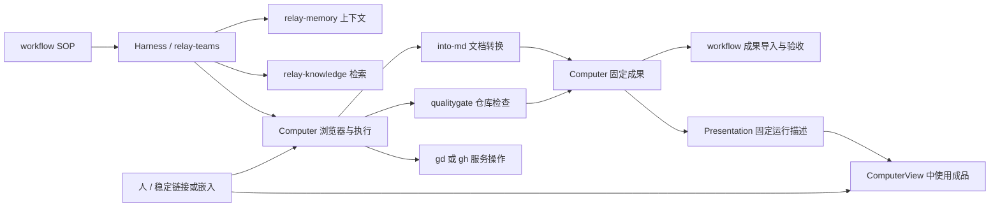
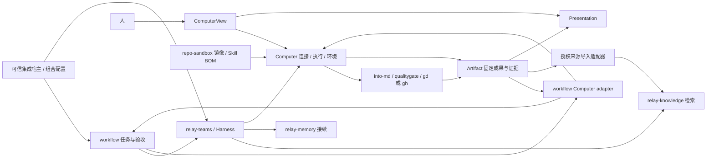

# coolplayagent 生态分工与集成设计

版本：设计基线 0.5；证据核对日期：2026-10-09；状态：接口适配待实现。

本文对应[产品需求 R11、R12、R14、R18–R35](../requirements/agent-computer.md)，依赖[Computer 技术契约](agent-computer.md)。仓库 README 或设计文档描述的是外部项目自身能力，不证明它已与 agent-computer 集成，也不代替对应发布件的实测。E07 根据 superpod 的场景研究补充产品集成边界，R32 为后续评测扩展。0.5 的 E08–E10 落实 R33–R35 的协作边界与可组合方案，新增契约不是外部仓库已有能力声明。

## E01. 责任与权威边界

| 产品 / 命令 | 拥有的能力与权威数据 | agent-computer 的使用方式 | 不转交给它的职责 |
| --- | --- | --- | --- |
| agent-computer | Computer、Sandbox、App、Principal/ConnectionSession、ViewerSession、执行、租约、工作文件、Artifact/Presentation | 核心 API/CLI、人的独立及嵌入 ComputerView、运维界面 | 模型决策、业务 Task/SOP 终态 |
| 集成产品 / 宿主 Web 应用 | 业务入口、自己的登录和任务体验 | 提供 Computer/Presentation 链接或嵌入 ComputerView，依 D14 对接身份 | Computer 控制租约、资源鉴权、应用实例状态；宿主身份不自动授权 |
| workflow-cli / `workflow` | SOP 定义、Run/Task、依赖、决策、证据门、任务租约、业务副作用记录 | Computer worker adapter 请求执行并回传固定结果 | Computer 状态、Pod 操作、文件系统底层元数据 |
| repo-sandbox / `repo-sandbox` | 开发目标、环境模板、镜像构建、可信开发会话 | 研发环境与 OCI 镜像生产；镜像经 digest 校验进入 Computer 发布清单 | 生产 Computer 的授权、隔离、资源调度 |
| computer-use-cli / `computer-use` | 桌面截图、窗口、鼠标和键盘动作、JSON 回执 | 后续 Desktop App 的动作驱动候选 | 浏览器 DOM/CDP、业务规划、环境创建 |
| skill-bom-cli / `skill-bom` | Skill 依赖、锁定、安装、校验和 BOM | Agent 初始化阶段部署已锁定内容 | 安装可执行工具、配置 MCP、执行 Skill、授予权限 |
| qualitygate-cli / `qualitygate` | 固定仓库快照、策略、任务约束的验证证据 | 对受控快照运行，结果作为 workflow 验收输入 | 业务流程编排、自动批准、上线授权 |
| relay-knowledge / `relay-knowledge` | 知识地图、仓库图、索引、GraphRAG、版本化上下文 | 在成果/代码提交后更新索引，向 Harness 提供检索 | 工作文件权威、任务完成状态、产品配置的任意修改 |
| relay-memory / `relay-memory` | 会话长期记忆、主题、时间线和接续上下文 | Harness 通过 prepare/remember 接口访问 | 执行回执、Artifact 清单和环境状态 |
| into-markdown / `into-md` | 文档/图像/媒体转换、诊断、来源和转换产物 | 在工具环境处理指定输入，捕获输出 | 云存储管理、自动开启远端数据传输 |
| relay-gitcode-cli / `gd` | GitCode API 的仓库、issue、PR、流水线操作 | 受控工具调用，使用特定主体凭据 | GitHub 专有接口、Computer 凭据管理 |
| relay-teams / `relay-teams` | 角色驱动的多 Agent 编排、模型执行与协作；E08 新增协作模块契约待实现 | 上层 Harness，按需分配共享/独立环境，各 Agent 通过 ConnectionSession 操作 Computer | Computer/Volume 生命周期、共享文件最终版本；接入 workflow 后的业务 Task/Run 终态 |

relay-mobile 是应用端/多设备协作入口，后续可提供 Computer 链接或消费嵌入与控制接口；其当前 README 主要说明移动项目及构建脚手架，不能认定已有 Computer 客户端。人的直接使用由 agent-computer 自己的 ComputerView 提供，不等待 relay-mobile。compare-agentharness、reason-future 不进入首版运行依赖链，不为它们臆造 CLI 接口。

## E02. 接入方式与现有缺口

### 核心与可选依赖

创建和使用 Computer 的运行依赖为控制服务、组织身份认证、Kubernetes/containerd/runsc、PostgreSQL、存储、OCI 镜像，以及使用 Browser 时的 Chromium/Playwright；人的图形入口由 ComputerView 提供。没有 workflow、knowledge、memory 或其他 CLI 时，人仍可通过链接使用 Computer，外部 Harness 仍可直接使用 API。Presentation 只额外依赖已发布成果和固定应用模板，不依赖某个业务任务仍存活。

底层计算与存储的候选、运维责任和默认选择见[选型分析](../decisions/compute-storage-selection.md)。E2B 等完整 Sandbox 平台是运行后端替代方向，不新增为必需 CLI；SeaweedFS 是新建私有 S3 的优先验证候选，已有合格 S3/RGW 时不另部署。

生态 CLI 的可执行版本和 Skill 内容分开锁定。采用 release 校验和/OCI digest 固定工具，采用 skill-bom 锁文件固定 Skill；一个 Skill 的存在不证明其工具已安装、MCP 已配置或权限已授权。

| 接入项 | 已有能力证据 | 本项目新增工作 | 发布依赖 |
| --- | --- | --- | --- |
| workflow | 定义、持久执行、租约、成果、证据与远程服务文档 | Computer worker adapter、身份映射、成果导入、故障对账 | 核心 API/Artifact 完成后接入 |
| repo-sandbox | 镜像与持久开发会话 | 将镜像解析到真实 OCI digest，记录平台/工具清单并验证兼容 | 可用于研发；不成为核心运行依赖 |
| computer-use | Windows/Linux 桌面动作，`exec-json`，动作后截图 | Desktop Driver 生命周期、坐标契约、租约代理与真实桌面测试 | 后续桌面阶段；Browser 首版不阻塞 |
| skill-bom | validate/lock/install/verify/bom | AgentSpec 到受控安装目录的启动适配和 BOM 引用 | 托管 Agent 示例；可由用户预装替代 |
| qualitygate | 快照绑定的 full 检查与结构化报告 | 捕获准确 Git 快照/策略/报告，转为 workflow 证据 | 编码任务示例 |
| relay-knowledge | repo 注册/索引/查询、远端服务、知识地图 | 授权源挂载、固定版本导入和索引新鲜度跟踪 | 知识工作流示例 |
| relay-memory | prepare/remember、HTTP 服务 | 会话授权、调用失败恢复与隐私设置 | Harness 可选，不阻塞 Computer |
| into-md | 转换、JSON/Bundle、来源诊断 | 输入版本到候选目录、输出捕获、资源与网络限制 | 文档处理示例 |
| gd | GitCode API、结构化命令、凭据入口 | 请求级凭据绑定、操作回执与未知副作用对账 | GitCode 工作流示例；GitHub 使用 gh |
| relay-teams | 模型执行和多 Agent 角色协作 | Computer tools provider、多对多 ConnectionSession、任务关联与 E08 可靠通信契约 | 发布团队组合时验证；核心不强依赖 |
| 集成产品 | 本次不假定任何现有产品已实现 Computer 嵌入 | 无凭据稳定链接、ComputerView/SDK、origin 配置、登录与授权、活动状态 | D14 与 T21–T24；独立入口不依赖宿主接入 |
| 运行成果 | 需求来自 issue #2，尚无本项目运行实现 | WebApplication Driver、Presentation、隔离试用、保存新版本与预算 | D15 与 T25–T27；无需新增外部通用托管服务 |

### repo-sandbox 边界

当前直接开发容器使用 privileged，并挂载目标主机根文件系统、Docker socket 和设备。它适合可信研发，不能直接包装 `dev up` 成生产沙箱。采用已有镜像构建能力不等于采用其运行配置；Computer 自己生成受限 Pod 配置并执行验收。

### computer-use 边界

当前 CLI 要求正常图形会话；Linux 依赖 DISPLAY/WAYLAND_DISPLAY 及 xdotool、截图等工具。它提供动作和风险等级检查，不进行用户审批，不提供 Computer 生命周期或浏览器 DOM 定位。其 `fake` runtime 只能验证协议，不证明实际 GUI 可用。

后续接入时始终通过 Computer 动作网关调用 `exec-json`，保护控制租约，不把通用子进程启动能力暴露成绕过 Computer 授权的旁路。风险等级不能替代业务审批或网页最终结果验证。

“人可以操作其他应用”的首版范围由 Browser/WebApplication 和文件界面满足，不需要先部署 computer-use-cli。原生桌面扩展还需要桌面会话、视频/画面传输、应用生命周期和人的输入驱动；现有桌面动作 CLI 不是完整远程桌面服务。

## E03. workflow 与 Workspace/Artifact 的关系

### 两种 Workspace

workflow 的 attempt workspace 固定 request/input digest、源 revision、输入产物和输出契约；Computer Workspace 长期存在。映射为：

```text
workflow run/node-instance/attempt
    -> Computer ConnectionSession + Candidate(base_manifest)
    -> Computer execution_id + generation
    -> Computer ArtifactVersion
    -> workflow typed artifact + accepted result
```

不能把 workflow 已有本地 Git checkout 适配器直接视为远程 Computer Workspace。其文档列有普通文件、路径、体积及不带 `.git` 的约束；需要 Git 元数据的质量检查或 Coding Agent 必须通过新适配器显式准备精确 Git 快照，并保留来源版本。

### 成果所有权

Computer 拥有通用文件字节、版本和生产执行证据；workflow 拥有自己的类型化成果记录、输入依赖和验收结论。首版采用**通过现有 workflow 成果上传/导入契约复制并校验内容**，不让 workflow 直接读 Computer 数据库，也不把 `artifact://` URI 当作 workflow 原生引用。

桥接表由 adapter 所在的可信集成宿主管理，记录：Computer artifact/version/hash、workflow artifact identity、输入依赖、生产 attempt、上传状态与幂等键。额外存储成本接受为首版明确取舍；未来直接引用外部存储需要独立 provider 契约和验收。

现有共享上传按 credential、assignment 和当前 lease 授权，重试键也在该范围内。旧 assignment 失效后不能继续上传或冒用新 assignment 的生产身份；先由 workflow 确认是否已导入/接受。新 attempt 若要复用旧 Computer 成果，必须把它重新声明为授权输入并生成新的来源映射，不能只改桥接表的 attempt ID。

导入过程保留来源 hash、媒体类型和 producer_ref；workflow 按自身契约验证类型和依赖，不能复制“执行成功”字样作为证据 PASS。已存在的相同内容导入可复用，但跨组织不共享权限。

### 运行成果与人的访问

adapter 可在受授权的 Computer 输出元数据中记录 `presentation_id、artifact_version_ref、computer_link/presentation_link`；这些是集成侧关联信息，不能宣称 workflow 已有新的原生 artifact 类型。已有 typed artifact 仍按原接口导入固定字节，新增关联通过 adapter 的桥接表及上层展示保存，待独立兼容设计后再扩展 workflow schema。

Presentation 与其源 Artifact 的内容身份固定，上层产品可提供“查看文件”和“打开应用”两个入口。点击链接仍由 Computer 认证和鉴权，workflow 能读取成果不自动授予浏览器控制或激活预算。应用启动成功/用户打开成果不是任务验收通过，任务完成也不是停止应用的触发器。人可以完全绕过 workflow，通过 ComputerView 自行创建文件、提交成果及使用被授权的 Presentation。

## E04. Computer worker adapter 协议

adapter 属于 workflow 集成侧，使用 Computer 公共 API；Computer 核心不知道 workflow 状态机，不接收“将任务置完成”的命令。

### 输入与持久关联

| 字段 | 来源及校验 |
| --- | --- |
| run/node-instance/attempt、request digest、workflow lease epoch | workflow 权威服务签发/核验，不从模型文本取得 |
| source revision、input artifacts、output contract | 冻结的 workflow 请求，准备前验证字节与类型 |
| computer/template、workspace、所需能力 | 已授权的部署 binding，业务定义不绑定集群细节 |
| execution idempotency key | adapter 首次绑定生成并持久保存，重连不能更换 |
| Computer ID、generation、ConnectionSession、Candidate、execution ID | Computer 返回并持久登记，明确区分 attempt 与执行代次 |

### 正常数据流

1. workflow 领取有效 attempt，adapter 验证当前 epoch 和能力授权。
2. 解析 Computer binding，创建/接入 Computer，绑定固定输入版本并分配 Candidate。
3. 首次调用前持久保存请求 digest 与幂等键，再提交 Computer execution。
4. 根据事件唤醒后查询权威执行状态；外部 workflow 租约续约和 Computer 租约续约分开进行，不能互相替代。
5. 执行结束，停止写入并提交 Computer Artifact。上层声明输出缺失时作为失败，不能提交空清单冒充结果。
6. 上传并验证 workflow typed artifact，记录两端成果映射。
7. workflow 检查当前 attempt、证据和版本，再提交业务结果；Computer 结果不自行解除业务依赖。
8. disconnect 仅释放本 adapter 的 ConnectionSession 和租约；自动空闲回收按 Computer 全局活动策略决定。任务完成不删除持久 Workspace、Artifact 或 Presentation，不停止仍有人使用的 Computer/成果实例。取消也仅作用于本 attempt 所属执行；共享资源的停止需另行授权并通过活动保护。

### 故障处理

| 情况 | 适配器行为 |
| --- | --- |
| execution 提交响应丢失 | 用持久幂等键查询原请求，不创建第二个执行 |
| adapter 崩溃 | 新拥有者读取桥接记录、确认 workflow 当前 attempt 后接续查询 |
| workflow 取消/失去租约 | 请求取消 Computer 执行；未确认停止时报告实际状态，迟到结果不再提交为有效业务结果 |
| Computer 成果已提交，workflow 上传失败 | 从固定引用重试导入，不能重跑生成成果的副作用 |
| workflow 结果提交响应丢失 | 查询 workflow 权威状态，不重复推进任务或重发外部动作 |
| 任一方返回 Unknown | 进入显式对账/人工路径，不把 transport retry 变成业务 retry |
| 两系统授权 scope 不一致 | 拒绝绑定；没有“组织名相同即可信”的隐含授权 |
| 旧 worker 迟到结果 | 保留审计，但由两端各自 epoch 检查拒绝权威更新 |

两个数据库没有跨库事务。以持久桥接记录、稳定操作键、固定成果和查询对账处理部分成功。workflow 的业务副作用 ledger 与 Computer 的执行 ledger 记录不同事实；只有实际外部结果经过业务核验，才能解决业务副作用不确定性。

## E05. 工具部署、数据流与升级

### 工具安装

镜像包含可执行工具和系统依赖，镜像 digest/工具版本写入环境清单。Skill 通过 `skill-bom install --locked` 或离线 `--frozen` 安装到独立 Agent 发现目录，启动 Agent 前运行 verify 并保存 BOM。活跃 Agent 读取期间不原地替换 Skill；切换版本需要排空或创建新实例。

工具命令采用 argv 和 JSON 输入/输出，不解析终端美化文本作为接口。每个适配器声明所需能力、超时、网络、凭据、允许的返回形状和错误语义；未知协议版本拒绝执行。工具安装不授予该工具网络或数据访问权限。

### 参考场景



- into-md 处理授权输入，远程来源/Provider 按其既有网络开关和 Computer 网络策略的交集执行；不能为转换方便自动开放全部网络。
- qualitygate 对准确 Git 快照和策略执行 full 检查，exit 2 或 incomplete 不能转成 PASS。报告绑定的 target 需要与 workflow 输入相符。
- relay-knowledge 对提交后的固定源版本建立索引；事件用于唤醒，索引完成仍需检查实际 ref、新鲜度和 partial/degraded 状态。索引失败不撤销 Artifact，也不虚构知识可用。
- relay-memory 由 Harness 写入会话记忆。Computer 不批量把所有文件/截图发送为记忆；写记忆失败不回滚已确认环境执行。
- gd 使用调用主体的 GitCode 凭据，HTTPS 验证必须在环境中显式启用并验证；不继承上游客户端默认配置作为本平台网络安全保证。对发布等副作用保留服务端 ID 供查询。

### 兼容与升级

兼容清单记录每个 CLI 的来源、release/commit、二进制 checksum、镜像 digest、平台、协议版本、Skill lock、测试证据和已知限制。源码 commit 仅作为本次研究证据，不自动成为部署锁。

接口兼容版本滚动升级；破坏性变更先排空实例，再更新 binding 和兼容清单。运行中的 Computer 固定原镜像和 Skill 版本。任何 adapter 失败均返回明确错误，不能绕开权限直接执行外部 CLI。

## E06. 证据台账与实施依赖

### coolplayagent 仓库证据

以下是 2026-10-09 读取的源码基线；链接固定到该提交。功能归纳以 README 与所列契约为依据，本次未运行外部产品验收。

| 项目 | 固定证据 |
| --- | --- |
| workflow-cli | [README](https://github.com/coolplayagent/workflow-cli/blob/e4968414018a0297502971dcb31f30b9faf872a3/README.md)、[Workspace](https://github.com/coolplayagent/workflow-cli/blob/e4968414018a0297502971dcb31f30b9faf872a3/docs/workspaces.md)、[共享成果](https://github.com/coolplayagent/workflow-cli/blob/e4968414018a0297502971dcb31f30b9faf872a3/docs/shared-artifacts.md) |
| repo-sandbox | [README](https://github.com/coolplayagent/repo-sandbox/blob/216145c4b532c9bdf2df0830f67ac3e6d2d935ce/README.md)、[开发运行时](https://github.com/coolplayagent/repo-sandbox/blob/216145c4b532c9bdf2df0830f67ac3e6d2d935ce/docs/development/dev-runtime.md) |
| computer-use-cli | [README](https://github.com/coolplayagent/computer-use-cli/blob/b848e4b029507db597167c5736f33a761063ce88/README.md) |
| skill-bom-cli | [README](https://github.com/coolplayagent/skill-bom-cli/blob/213d324bea891fec9d06ecc451d673295935e4a5/README.md) |
| qualitygate-cli | [README](https://github.com/coolplayagent/qualitygate-cli/blob/1a9d87c25c1ba9767ed1fce7c2fdc2ec912b95bf/README.md) |
| relay-knowledge | [README](https://github.com/coolplayagent/relay-knowledge/blob/f5dc721c78114660cd9adfacab39c057beb5e9e7/README.md) |
| relay-memory | [README](https://github.com/coolplayagent/relay-memory/blob/e188a5b2031c336169ffe5488e346c17949e14a4/README.md) |
| into-markdown | [README](https://github.com/coolplayagent/into-markdown/blob/72535b14ed144f0119aad501afea099d9a93077e/README.md) |
| relay-gitcode-cli | [README](https://github.com/coolplayagent/relay-gitcode-cli/blob/51fa644b837a7c213caab47d07e56a49b687d43d/README.md) |
| relay-teams | [README](https://github.com/coolplayagent/relay-teams/blob/d23f4daadb76fb5c2ba2fd5c9d3229ee8997eb72/README.md) |
| relay-mobile | [README](https://github.com/coolplayagent/relay-mobile/blob/440b4d9a5f0777b70967cfcd24f6c29334e13dca/README.md) |

workflow 当前开放的[混合 Worker 迁移 issue #15](https://github.com/coolplayagent/workflow-cli/issues/15)、[业务进度与预算 issue #16](https://github.com/coolplayagent/workflow-cli/issues/16)及[验收基准 issue #3](https://github.com/coolplayagent/workflow-cli/issues/3)是关联工作，不将其标题当作能力已完成证据，也不要求它们全部关闭才能交付 Computer 独立 API。适配发布以本项目 T14 的具体契约验收为准。

### 原始 issue 的六项参考

| 参考 | 可借鉴内容 | 本项目结论 |
| --- | --- | --- |
| [agent-compose](https://github.com/chaitin/agent-compose) | 声明、Agent provider、运行驱动、工作区与调度 | 借鉴定义/适配器，核心不依赖该 daemon，不重复其任务编排 |
| [Cloudflare Computer](https://github.com/cloudflare/computer) | Durable Object 权威文件状态与可插拔执行 | 借鉴存算分离；上游标注 preview，不用作首版生产基础 |
| [AgentFS](https://github.com/tursodatabase/agentfs) | SQLite 系文件、KV、工具调用记录与挂载 | 后续存储适配研究；不能当作现成分布式共享并发方案 |
| [OpenShell](https://github.com/NVIDIA/OpenShell) | 沙箱、文件/网络/凭据策略 | 隔离适配候选；首版选择 runsc，不叠加另一套控制面 |
| [Cua Driver](https://cua.ai/docs/cua-driver/concepts/how-cua-driver-works) | 观察、动作、控件与回执 | 后续桌面驱动参考；Browser 首版使用 Playwright |
| [Tetral](https://tetral.ai/blog/the-next-scaling-problem/) | runtime、Computer 和 Workspace 独立调度/持久化 | 架构参考，无软件包依赖 |

这些动态来源于 2026-10-09 检查，尚未选为运行依赖。选中其他后端时必须另立兼容矩阵，不从参考 README 推导性能或安全结论。

### 跨仓库工作顺序

1. agent-computer 完成 D0 文档与 D1 兼容性实验，再实现资源、文件和执行核心。
2. agent-computer 交付人/Agent 统一连接、独立/嵌入 ComputerView、WebApplication 与 Presentation；宿主产品随后按公共契约接入。
3. workflow 集成侧新增 Computer adapter 和成果桥接，依赖稳定 API，不依赖 Computer 内部表；验证任务清理与人的活动隔离。
4. 托管 Agent 示例接入 skill-bom；可信镜像流水线可调用 repo-sandbox。
5. 按 E08–E10 实现可选组合：先 relay-teams 协作模块和 Computer provider，再完成开发/资料两条链路的 qualitygate、into-md、relay-knowledge 适配；memory 按接续需要启用。组合逐项固定版本并执行 T40–T43，核心仍可独立运行。
6. Desktop 阶段再扩展 computer-use；不把 Browser v1 变成桌面系统项目。

上述是待办分工，本次不创建远端 issue、不修改其他仓库、不宣称跨产品集成已发布。

## E07. Personal Agent、AI-IM、Agent Space 与学习闭环

依据[SC01–SC04 的固定来源与能力对照](../requirements/agentic-scenarios-and-gaps.md)，Computer 继续作为外部产品的环境/执行层。以下接口均待实现；角色名称、外部项目已有 API 或研究图谱不证明实际集成存在。

| 集成责任方 | 外部权威 | Computer 的交付与边界 |
| --- | --- | --- |
| 个人代理/团队产品 | 用户、频道、私聊、成员与职责 | AR01 ContextBinding、独立个人/shared/ephemeral 资源；不保存聊天正文或把 Bot 拥有者权限传播给成员 |
| 身份/策略服务和连接器代理 | 身份、逐跳委托、业务许可和真实凭据 | AR02 核验许可输入/目标/版本、限制出口、关联执行；不内置通用业务审批系统或让模型批准自己 |
| Harness/relay-teams | 规划、上下文、角色分工与子任务 | AR03 环境版本/事实交接、独立 Candidate、AR05 准入预算；模型会话失败不销毁 Computer |
| workflow/外部调度器 | Task/Run、cron/事件规则、触发去重、验收/取消 | AR05 稳定触发键、幂等调用、事件补读和实际执行状态；触发桥接记录归适配器，不复制业务任务权威 |
| knowledge/memory | 检索、摘要、长期记忆与派生数据治理 | AR04 受控来源/证据、撤权失效事件；消费者实施删除/撤权并提供处理记录，不能把审计权限变成训练授权 |
| MCP 客户端/工具适配器 | 模型工具发现与传输协议 | AR06 映射原生 API、能力协商、handle/版本/幂等；可选独立发布，无适配时不宣称支持 |
| A2A Agent/Harness 网关 | Agent Card、任务委派与业务终态 | 复用授权执行/成果引用；Computer 不成为 Agent，也不将进程成功映射为 A2A 业务成功 |
| 外部评测/Agentic RL 平台 | 数据集、策略、rollout、reward、训练/权重/发布 | AR07 可选隔离 episode 和 AR04 授权证据；无生产探索、无训练服务随核心安装 |

典型闭环为：宿主验证消息与身份→解析 binding 和委托→外部任务获得执行权→Computer 准入/执行→固定成果和可核验回执→外部独立验收→授权分享/通知。等待审批/依赖时，外部任务保留控制状态，Computer 按全局活动与检查点条件释放计算；业务取消只影响所属执行。

“私人事务转团队成果”必须先在独立环境处理私人连接器/登录状态，再显式发布获准内容；禁止先放进共享 GUI 再用成果 ACL 假装其他观察者没看过。新成员加入不自动获得过去的私人上下文，历史绑定切换按 AR01 处理。

集成验收覆盖 T31–T36；启用评测扩展再执行 T37。上线前固定每个适配器的二进制/协议/schema、issuer/audience、授权检查、超时和未知结果规则。旧接口缺少所需字段时保留明确缺口，不访问外部产品内部数据库或绕过其权威 API。按 E06 的顺序交付核心后，优先验证 U9–U11 的一条真实产品闭环，最后扩展 U12。

## E08. 多 Agent 协作与通信组件

本节是 R34 的新增设计目标，不表示 relay-teams 已实现持久消息或恢复接口。Team、TaskGroup、CollaborationSession 和环境分配遵循 D18；用户业务聊天/频道仍属于宿主产品，Agent 协作消息属于 Harness。

### 组件、仓库与部署

通用协作基础设施独立于 agent-computer，首期在 relay-teams 仓库中形成独立模块：负责协作成员寻址、范围路由、持久消息和接续；模型 provider/执行循环通过适配器使用模块，模块不绑定特定模型，也不管理 Computer 资源。Computer provider 只消费公开的环境 API、事件和成果引用。

只有出现第二个真实 Harness/产品复用方，并完成跨实现契约测试、明确发布兼容与维护责任后，才评估抽取独立组件仓库。独立部署由连接规模、故障隔离和运维需求决定；独立仓库不必产生新微服务，本设计不新增强制消息中间件。首期随 relay-teams 交付，不随 Computer 核心安装。

| 权威层 | 唯一拥有的事实 | 不能据此推导的事实 |
| --- | --- | --- |
| 宿主产品/Harness | 团队成员、协作角色、消息路由、模型上下文、分派关联 | 成员身份不授予 Computer ACL，角色命令不授予 GUI 控制权 |
| workflow（启用时） | Run/Task、attempt、依赖、任务租约、重试/取消与业务验收 | Task 成功不等于停止 Computer；分派消息不能代替任务领取 |
| Computer | ConnectionSession、控制租约、execution、环境状态、固定成果 | exit 0 不等于业务通过，执行事件不是 Agent 通用邮箱 |

未启用 workflow 时，业务结果由选定的外部 Harness 管理；启用后协作模块仅保存其引用和观察投影，不能独立修改同一业务终态。工作领取/取消失败需查询权威系统；两个服务间不假设跨库事务。

### 可靠通信的最小契约

机制依据与假设见[设计参考 C02–C04、C07–C09](../decisions/multi-agent-collaboration-foundations.md)。这些是待实现的跨组件契约，不要求引入文献中使用的消息中间件或工作流引擎。

- 每条消息有稳定消息 ID、发送主体、接收主体或有界任务组范围、协作会话及相关任务/attempt 引用；鉴权在发送、投递和补读时核验当前成员与委托。外部引用和消息正文不是执行授权。委派另附目标、固定输入、依赖、输出/验收契约、边界、截止时间及累计预算，接收方核验后再申请执行。
- 持久化接收后才确认收到；采用至少一次投递，接收侧按稳定消息 ID 去重。区分 received、processed 和外部业务结果；processed 只代表接收处理完成，不代表成果验收或远端副作用成功。
- 接收方在处理前持久关联消息 ID 与稳定操作键；若触发 workflow 分派或 Computer execution，使用其幂等提交/查询接口恢复。持久去重记录自身不保证外部副作用 exactly-once；Unknown 查询原执行并对账，禁止换 ID 盲重试。操作键的作用域包含租户/主体及目标操作，绑定规范化请求摘要；同键不同请求必须拒绝。明确键与结果记录的保留期，过期请求进入查询/人工对账，不能直接当作新操作。
- 支持有序游标补读和确认水位；只保证声明的单会话顺序，不假设跨会话全局有序。游标到期先同步权威状态及水位，历史重放不得自动重触发副作用。Computer 事件游标独立维护。有跨会话依赖的消息附稳定因果父引用和输入版本；接收侧在前置处理状态/权威任务条件满足前不派发副作用，缺项先等待、查询或明确失败。时间戳不代替因果，未声明的全局顺序不作保证。
- 配置每会话/接收方的消息大小、队列长度、重试期限和保留期；超限返回机器原因和可重试信息，不静默丢消息或无限广播。耗尽重试的消息进入可查询失败状态，取消/撤权处理保留容量。Harness 另限制每个父任务的子 Agent 数、嵌套深度及累计预算，父任务取消传播到所属工作并返回实际停止状态；取消不自动补偿已经完成的外部动作。
- 成员撤权后拒绝新投递、补读和成果读取；同时由资源授权链撤销关联 ConnectionSession/委托，不能仅从通信成员表删人。已观察的内容不能远程收回，撤权事实记录实际收敛结果。
- 消息传递有范围的任务摘要和受控引用，大文件走固定 Artifact。跨 Computer 接续使用 AR03 清单与新授权，不广播全部模型历史、秘密或私有推理，不把引用当 bearer token。

上述能力由 relay-teams 的实现方导出版本化接口和存储契约，并执行 T40；本仓库不臆造其现有 CLI 子命令。单机协作也须满足所声明的持久性与重启恢复，不能仅凭内存队列演示宣布可靠通信已交付。

## E09. 以 Computer 为环境与成果中心的可组合集成

“串起依赖功能”落实为可选择的能力组合、可信适配器、执行关联和固定成果交接。配置设计与示例由本仓库提供，运行时由集成宿主解析并调用各组件公共接口；核心 Computer 不变成跨产品消息代理或业务任务调度器。

### 组合与依赖

| 组合 | 组件和必需关系 | 交付出口 |
| --- | --- | --- |
| 独立电脑 | E02 的核心环境依赖；不要求任何生态 CLI、Agent 或 workflow | ComputerView、浏览器/文件、Artifact、按需 Presentation |
| Agent 团队 | 核心 + relay-teams/Harness 与 Computer provider；workflow 可选 | 分组协作、共享/独立环境、成果与人工接续 |
| 持久业务流程 | 核心 + workflow 及 E04 adapter；按任务选择 Harness | 持久 attempt→执行→成果导入→外部验收 |
| 开发与资料处理 | 叠加所选工具；开发示例需要 qualitygate，资料示例需要 into-md；GitCode/GitHub 操作按目标启用 gd/gh | 固定代码/报告及检查证据 |
| 知识与接续 | 按需启用 relay-knowledge 与 relay-memory；资料索引示例必须启用 knowledge，memory 仅在声明长期记忆时必需 | 精确来源的检索、按授权保存的接续上下文 |
| 后续桌面 | 核心 + 经认证的 Desktop Driver/computer-use；当前未实现 | 原生桌面能力，不阻塞 Browser 组合 |

repo-sandbox 属于可信镜像生产环节，可由其它合格流水线替代；skill-bom 仅在声明锁定 Skill 安装时需要。所有组件均独立发布，选择组合只声明所需能力，不自动获得其安装、升级或外部账号管理权。

### 接入位置、身份与失败范围

所有启用项按 E05 锁定发布件、adapter/schema 版本与兼容证据。下表的“身份”均受资源 ACL、委托和出口策略约束，不能从工具安装推导权限。

| 能力 / 责任方 | 运行位置与调用方 | 输入 → 输出 | 身份与失败处理 |
| --- | --- | --- | --- |
| Computer / 核心 | 控制面与受限 Sandbox；人、Harness、workflow adapter 调用 | 模板、固定输入、授权动作 → execution、Artifact、Presentation | 各自 Principal/ConnectionSession；Unknown 查询原 execution，资源不可用阻断相关步骤 |
| relay-teams / Harness | 外部或独立受控托管进程；宿主/workflow 驱动 | 目标、成员、输入 refs → 分派、协作会话、候选成果 refs | 独立 Agent 身份与收窄委托；会话失败不删除 Computer，恢复先查询工作权威 |
| workflow / 集成 adapter | 可信集成宿主，独立于用户 Sandbox | attempt、输入契约 → 导入成果、验收结论 | 当前 assignment/lease；桥接关联和稳定键持久保存，部分成功按 E04 对账 |
| repo-sandbox / 镜像流水线 | 可信研发/构建侧，不进入生产控制权 | 环境模板 → 固定 OCI digest 与工具清单 | 构建身份；失败阻断新镜像发布，已有认证镜像不漂移 |
| skill-bom / 启动适配器 | Harness 初始化的受控工具目录 | Skill lock → 安装/校验与 BOM | 安装身份无资源授权；校验失败阻断该 Agent 启动，不影响人的连接 |
| into-md / 工具适配器 | Computer Execution Sandbox | 授权输入版本 → Candidate 中的转换文件及来源记录 | 执行主体和受限网络；失败保留诊断，不以空文件提交成功 |
| qualitygate / 检查适配器 | 独立检查 Sandbox，读取精确 Git 快照 | 固定代码、策略 → 快照绑定报告 | 独立校验身份；incomplete/失败阻断相应验收，保留代码成果 |
| gd/gh / 服务适配器 | 受控工具环境和凭据代理 | 授权仓库/操作 → 服务端 ID 与回执 | 调用主体的限定凭据；未知结果先查询服务端，不重发发布动作 |
| relay-knowledge / 索引适配器与客户端 | 外部服务或授权 worker；Harness 直接查询 | 固定源版本及 ACL → 索引状态、版本化检索结果 | 受限来源授权；失败标记索引未就绪，不撤销 Artifact、不冒充新鲜结果 |
| relay-memory / Harness | 外部服务或独立客户端 | 获准摘要/来源 refs → 记忆引用与接续上下文 | 会话/用途授权；失败不回滚执行，缺失记忆时披露限制并使用现有事实 |
| computer-use / Desktop Driver | 后续 GUI 环境，由 Computer 动作网关调用 | 当前观察和控制授权 → 桌面回执 | 原控制租约与代次；未认证不启用，不直连形成控制旁路 |

### 组合配置入口（待实现）

集成宿主接受 `composition.yaml`，这是独立的集成配置设计，不是 ComputerSet、部署 installation 或现有外部 CLI 的配置格式。首期不新增 `agent-computer compose` 命令。宿主预检所选服务、adapter、版本与授权，再生成各系统原生请求；ComputerSet 仍仅管理原有环境对象。

配置最小字段为 `formatVersion`、组合名、兼容锁引用、服务/工具启用项及资源/输入引用。成员与 TaskGroup 定义留在 Harness，配置中的 ContextBinding 引用不复制成员表；动态分配使用预授权模板与预算。下面是“团队开发 + 持久验收 + 知识检索”的完整语法示例，所有 `demo-*` 值均为待替换的登记引用，未提供可运行环境或可执行 schema：

```yaml
formatVersion: 1
composition: team-development
releaseLockRef: demo-certified-release-lock
services:
  computer:
    endpointRef: demo-computer-endpoint
    identityRef: demo-computer-client
  teams:
    enabled: true
    endpointRef: demo-teams-endpoint
    identityRef: demo-teams-client
    adapterRef: demo-teams-computer-provider
  workflow:
    enabled: true
    endpointRef: demo-workflow-endpoint
    identityRef: demo-workflow-worker
    adapterRef: demo-workflow-computer-adapter
  knowledge:
    enabled: true
    endpointRef: demo-knowledge-endpoint
    identityRef: demo-knowledge-source-reader
    adapterRef: demo-artifact-knowledge-adapter
  memory:
    enabled: false
tools:
  qualitygate:
    enabled: true
    toolRef: demo-qualitygate-release
    adapterRef: demo-qualitygate-evidence-adapter
  intoMarkdown:
    enabled: false
  gitHosting:
    enabled: false
resources:
  workspaceRef: demo-team-workspace
  environmentTemplateRef: demo-development-template
  contextBindingRef: demo-shared-binding
inputs:
  artifactVersionRefs: [demo-source-artifact-version]
```

引用由可信宿主的登记配置解析，endpoint 不携带凭据，identityRef 指向受控身份取得方式；每名 Agent 另行鉴权，不能共享集成宿主的管理凭据。releaseLockRef 解析到 E05 的精确发布件/checksum/OCI digest、Skill lock（启用时）、协议版本和兼容证据；adapterRef/toolRef 必须在该锁中有可验证条目。配置无明文秘密、浮动版本或自动下载执行的任意命令。

独立电脑组合省略可选服务和工具；省略项等同禁用。资料组合启用 intoMarkdown/knowledge 并选用资料模板；长期记忆需显式启用 memory。repo-sandbox 和 skill-bom 的输出分别通过环境模板的镜像 digest、Skill lock/BOM 接入，不要求其服务常驻；Desktop 在模板能力未认证时拒绝启用。

配置解析与兼容预检失败时不派发组合工作，指出缺失项；启用的服务不可用时，依赖该服务的步骤进入外部权威的失败/等待状态，不静默删掉验收步骤。已确认执行、固定成果和人的连接仍按各自生命周期保留。组件移除仅关闭该集成的后续调用，资源清理由原系统在授权与活动检查后处理。配置不赋予安装/升级组件或级联删除环境的权限。

### 关联与数据流



箭头表示 API/成果交接或构建输入，不表示模块共享数据库。适配器保存 composition revision、外部会话/task/attempt、Computer/ConnectionSession/execution/generation、Artifact hash 和稳定操作键的关联；跨系统不共用事务。Trace/关联 ID 用于查询，不授予权限。模型消息、检索和记忆无需经过 Computer；通过执行来源、固定成果和独立回执串联闭环。

## E10. 两条端到端组合流程

两条流程均为待实现的参考交付：每一步输出进入下一步的明确输入，依赖失败不得伪造业务通过。示例采用 workflow 持久验收，未启用它的其它组合按 D18 由 Harness 拥有任务结果；这里不定义额外流程引擎。

### A. 团队并行开发到运行成果

| 步骤 / 责任方 | 输入与动作 | 输出与验收证据 |
| --- | --- | --- |
| 1. 集成宿主/构建流水线 | 选择已认证模板、固定源 Artifact/revision；需要时用 repo-sandbox 构建镜像、skill-bom 校验 Skill | EnvironmentVersion、镜像 digest、BOM、预检记录；未认证组合不启动 |
| 2. workflow / relay-teams | workflow 固定输入、拆分依赖并提供有效 attempt；Harness 为该目标建立任务组和角色关联 | 分派引用与当前租约；协调者不强制分配 Computer |
| 3. Computer provider / 执行者 A、B | 分别鉴权，共用授权 Workspace；选择同台或多台 Computer，独立 Sandbox/Candidate | 同一 base_manifest 的独立候选、各自 execution/generation；无共享可写 inode |
| 4. 执行者 / 评审者 | 执行修改，排空并提交固定分支成果；独立检查环境对各自精确 Git 快照运行 qualitygate | Artifact hash、源 revision、检查报告和评审结论；failed/incomplete 不计通过 |
| 5. 集成者 / Computer | 从固定分支成果在新 Candidate 显式合并；CAS 冲突保留候选并重新对齐输入 | 合并后的固定版本；在独立检查环境重新检查最终快照，旧分支报告不替代 |
| 6. workflow adapter / 验收方 | 导入最终成果及精确快照报告，校验来源、契约与当前 attempt | 真实导入/验收回执及桥接记录；上传重试不重新执行开发，旧 attempt 不推进终态 |
| 7. 人 / Computer | 按独立授权创建 Presentation，用户打开固定版本并交互；仓库发布按需显式调用 gd/gh | 应用健康、可访问的固定成果、实际交互证据；业务完成不回收人的活动，发布 Unknown 查询服务端 |

knowledge 可按获准源 revision 更新索引，memory 可保存经授权摘要；失败分别标记未就绪，不取消已提交代码。Git 快照由适配器按 E03 显式准备，保留质量检查所需 Git 元数据与来源；模型可写候选不能篡改检查策略或验收方。T42 覆盖该流程与合并冲突、质量不完整、适配器崩溃和导入部分成功。

### B. 资料采集到知识索引与 Agent 接续

| 步骤 / 责任方 | 输入与动作 | 输出与验收证据 |
| --- | --- | --- |
| 1. workflow / Harness | 固定资料任务、来源与输出契约，申请个人或共享 binding；成员和来源逐项授权 | 当前 attempt、环境与来源授权；私人登录状态不挂入共享 GUI |
| 2. 人/采集 Agent / Browser | 按控制租约采集资料，必要时人工登录后交还；捕获获准原始文件 | 固定原始 Artifact、来源和执行回执；profile/Cookie 不进入资料成果 |
| 3. into-md / Computer | 在独立 Candidate 中转换固定输入，保留转换参数、版本和来源 | 转换文件、诊断与执行证据；失败或缺失输出不冒充完整转换 |
| 4. 评审者 / workflow adapter | 检查内容、引用和可分享范围，提交获准固定版本并导入验收 | 审阅证据、Artifact hash 与业务回执；私人数据经显式批准后才进入共享来源 |
| 5. 来源适配器 / relay-knowledge | 校验获准成果，复制并校验固定字节到受控来源；固定 revision/快照后请求索引，记录 source↔Artifact 桥接 | 索引 task/scope、确切源版本、新鲜度和 partial/degraded 状态；Artifact URI 不冒充原生 knowledge URI |
| 6. Harness / relay-memory（启用时） | 对获准摘要、来源 refs 和未决事项保存记忆，禁止自动上传全部页面或对话 | 记忆引用或明确失败记录；无记忆服务时仍可从固定成果和事实清单接续 |
| 7. 后续 Agent / Computer | 重新授权，查询索引状态；用固定来源与 AR03 事实清单继续工作，需要环境时再连接/启动 | 检索引用可回查成果；新观察与 Unknown 对账记录；未就绪时可按授权直接读成果并披露检索限制 |

索引桥接由可信适配器保存来源授权、用途和撤权关联；撤权/删除传播到受控索引和记忆消费者，并记录实际处理结果。资料成果已完成、索引未就绪是两个事实：若任务契约要求可检索，workflow 在索引验收前不能宣布整个任务成功。T43 覆盖索引中断/恢复、版本错配、partial/degraded、记忆失败与来源撤权；不能用一次成功查询证明整个来源已完整索引。
