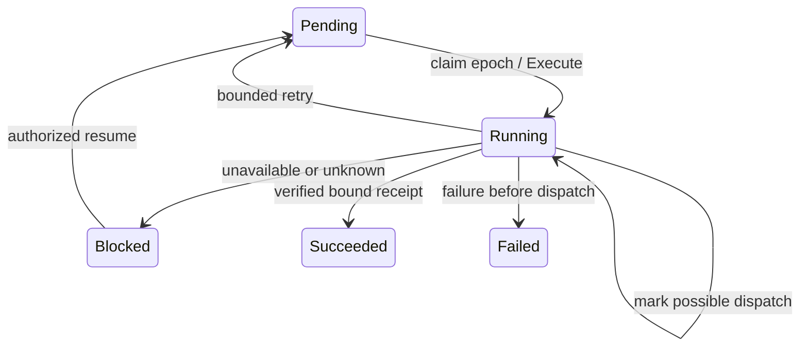

# 11. Durable reconciliation coordination

## 11.1 Delivered boundary

`crates/store::reconciliation` provides PostgreSQL-backed intent claiming, lease renewal, dispatch admission, completion receipts and blocked-work recovery for trusted workers. Operation queries now return per-intent `progress` and a consistent event `watermark`. This implements the database coordination part of D03/D08/D12.

The HTTP service does not run a backend worker. Newly applied operations remain `Queued` until a trusted worker calls the coordination API. `reconciliation.coordination` is `control-plane`; the runtime `reconciliation` capability remains `unsupported`. Kubernetes/gVisor, storage provisioning, runtime grants, backend health and physical fencing are still required before a runtime release. A successful database fixture is not an observed Pod, browser, filesystem or running Computer.

## 11.2 Admission and ordering

Apply binds each operation to the credential ID that admitted it, without storing the bearer secret. Claim, renewal, dispatch and completion recheck that credential's organization, principal, expiry, revocation, `definitions.manage`, and the original plan's current definition/transitive-reference permissions. Credential/principal row locks serialize admission against revocation, and the organization stream lock serializes grants, state and events. Authority is checked again before commit.

Migration 4 adds this binding and stable step IDs to existing data. Pre-migration operations have no credential binding and are blocked at claim; the migration never invents authority. A rotated credential does not automatically authorize an operation admitted by an expired/revoked credential. Undispatched blocked work can be abandoned, then replanned/applied with fresh credentials and revision conditions. Resolving already-dispatched work after permanent revocation needs a future privileged backend recovery path; it remains blocked here.

Within an operation, all earlier intents must succeed before the next ordinal is claimable. Across operations sharing a resource, earlier unresolved intents hold that resource's place. A blocked operation therefore excludes newer work on that resource while unrelated operations can proceed. Pinned revisions are processed in publication order; the queue does not silently coalesce old plans into newer specs.

## 11.3 Worker API

These Rust methods require trusted control-database access. They are not remote endpoints and are never available to user Sandboxes.

| Method | Contract |
| --- | --- |
| `claim_reconciliation` | Explicit organization and WorkerId; returns Idle, a leased task, or persisted Blocked admission failure |
| `renew_reconciliation` | Extend a live, currently owned epoch; never shorten or resurrect a lease |
| `begin_reconciliation_dispatch` | Persist the dispatch marker and return one non-cloneable dispatch permit |
| `finish_reconciliation` | Atomically record Applied, Retry, Blocked or undispatched Failed, operation progress and event/Outbox |
| `inspect_reconciliation` | Trusted local diagnostics from a repeatable-read snapshot |
| `resume_reconciliation` | Recheck authority and return blocked steps to Pending without erasing dispatch uncertainty |
| `abandon_reconciliation` | Fail blocked remaining work only when it has no unresolved external effect; preserve completed resources |

Lease durations are explicit whole seconds from 1–300, using the database clock; the design's worker default is 30 seconds with renewal every 10 seconds. No autonomous renewal loop is shipped yet. Each claim increments a checked monotonic epoch. Expired epochs cannot renew, start dispatch or commit a new completion, including when a transaction outlives its deadline. The opaque in-process handle cannot be deserialized from client input. Its epoch protects database writes; it is independent of Computer generation and does not terminate an old process.

## 11.4 Unknown outcomes and receipts

Before an external action, a worker must persist `dispatch_started`. The marker means the action **may** have happened, including when admission's response was lost. It survives lease expiry and database restart. A replacement claim has `Observe` mode and cannot receive another dispatch permit. The worker must inspect the same stable `step_id`, resource ID, pinned revision/spec digest and actual backend identity.



Retry delays are explicit 1–3600 whole seconds. A retry preserves the marker; a later claim uses `Observe` whenever the marker exists. There is no generic clear-marker or “retry create” escape hatch. A worker can block unresolved work for a backend-specific recovery procedure. Abandoning or declaring a terminal failure after possible dispatch is rejected. Neither missing Pod metadata nor lease expiry establishes physical termination.

An `EffectReceipt` binds step, resource, revision, spec digest, backend, actual object UID and evidence ID. The store validates the bindings and bounded identifiers; a trusted adapter must independently verify the backend facts. Receipt strings are not proof of those facts, and this release contains no production adapter that issues them. Every finished lease epoch stores an immutable result. Exact completion retries return their original response even after a later claim; changing that epoch's result is an idempotency conflict. Replaying a receipt cannot overwrite current progress.

Result, progress, operation aggregate and event/Outbox commit together. A failure at the last receipt write rolls everything back. `Succeeded` requires every intent to succeed. `Failed` stops further claims for that operation; remaining unstarted intents do not run. `Blocked` requires explicit repair/resume. Completed resources are preserved when later work fails or is abandoned.

## 11.5 Progress and local repair

`GET /v1alpha1/operations/{id}` and apply retries include ordered `progress`: step/resource/revision, state, attempts, dispatch marker, reason, next eligible database timestamp and event sequence. `watermark` identifies the organization stream position for the same snapshot; top-level `event_sequence` remains the original publication event. Worker IDs and credential IDs are not included. Existing credential and plan-permission checks still protect these routes.

Use private database access for diagnostics when the submitting credential can no longer read the operation:

```bash
bazel run //:agent-computer-server -- reconciliation-inspect \
  --database-url-file /run/secrets/agent-computer/database-url \
  --organization acme --operation OPERATION_ID

bazel run //:agent-computer-server -- reconciliation-resume \
  --database-url-file /run/secrets/agent-computer/database-url \
  --organization acme --operation OPERATION_ID

bazel run //:agent-computer-server -- reconciliation-abandon \
  --database-url-file /run/secrets/agent-computer/database-url \
  --organization acme --operation OPERATION_ID
```

Resume requires current admission authority. Abandon is trusted operator administration and only changes the queue; it does not roll back definitions, delete resources or claim to cancel a process. Both require an existing Blocked operation in the explicit organization. Commands print the resulting status and fail closed otherwise.

## 11.6 Verification and remaining work

Ten real PostgreSQL cases cover simultaneous claim exclusivity, dependency order, shared-resource barriers, independent progress, lease expiry, WAL crash recovery, changed completion receipts, exact receipt replay, grant/credential/reference revocation and dispatch lock races, legacy unbound operations, block/resume/abandon, final-write rollback and completion crossing lease expiry. The deadline tests use real database time. Synthetic adapter receipts verify only metadata admission/binding and never count as runtime acceptance.

The server tests verify current progress/watermarks over HTTP, and an independent TCP process exercises all three repair commands. The full Cargo/Bazel suite has 103 tests: 28 domain, 28 definitions, 7 CLI, 33 PostgreSQL and 7 server. Run the [database test commands](08-persistence.md).

The inspected development host has no Docker CLI/runtime and no registered repo-sandbox targets. No Kubernetes/gVisor experiment was run. Worker scheduling, real backend adapters, authority at the external action boundary, immutable instance identity, old-process fencing and all full T01–T43 runtime acceptance remain pending.

Later increments added [the Kubernetes adapter](12-kubernetes-adapter.md) and [the retained Volume worker](13-volume-provisioning.md), including immutable backend UID records. These narrow components do not complete Computer runtime coordination.
