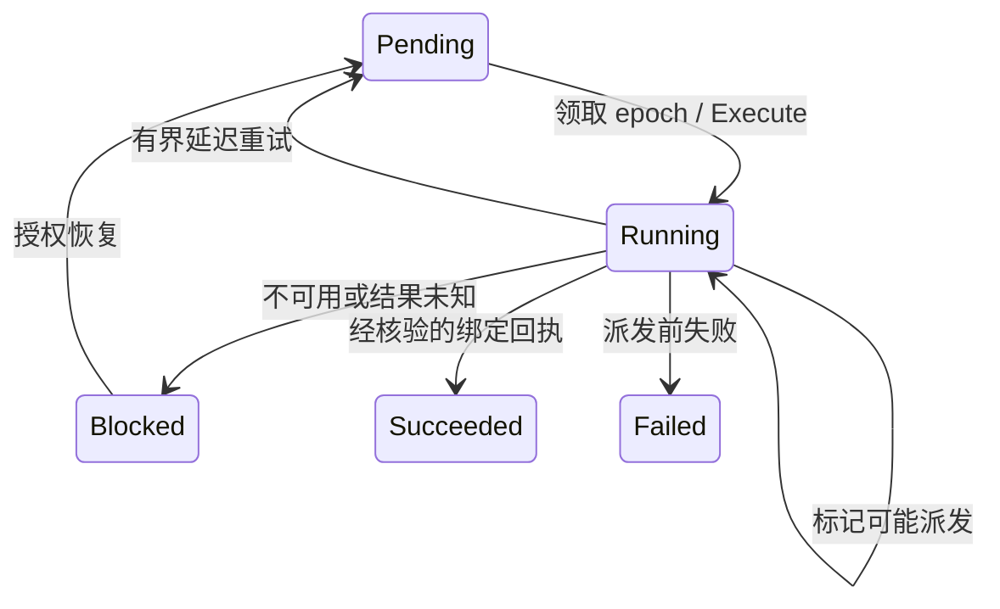

# 11. 持久化协调与租约

## 11.1 已交付边界

`crates/store::reconciliation` 为可信 worker 提供基于 PostgreSQL 的意图领取、租约续期、派发准入、完成回执及阻断恢复。operation 查询现返回逐意图 `progress` 和一致的事件 `watermark`。这实现了 D03/D08/D12 的数据库协调部分。

HTTP 服务不运行后端 worker。新 apply 的 operation 在可信 worker 调用协调接口前保持 `Queued`。`reconciliation.coordination` 为 `control-plane`，运行协调能力 `reconciliation` 仍为 `unsupported`。Kubernetes/gVisor、存储创建、运行授权、后端健康与物理 fencing 仍是运行发行的前置条件。数据库 fixture 成功不能当作已观察到 Pod、浏览器、文件系统或运行中的 Computer。

## 11.2 准入与顺序

apply 将 operation 绑定到当时准入的凭据 ID，不保存 bearer 秘密。领取、续租、派发和完成都重新检查该凭据的组织、主体、到期、撤销、`definitions.manage`，以及原计划所需声明/间接引用权限当前仍有效。凭据/主体行锁串行化准入和撤权，组织序号行锁串行化 grant、状态和事件。提交前再次检查权限。

迁移 4 为现有数据添加凭据绑定与稳定 step ID。迁移前的 operation 没有凭据绑定，领取时会阻断，迁移不会推断授权。轮换后的新凭据不自动授权旧的已过期/撤销凭据所提交的 operation。尚未派发的阻断任务可放弃，再以新凭据和版本条件重新 plan/apply。永久撤权后已派发任务的核对还需要后续具备独立权限的后端恢复路径，当前继续保持阻断。

同一 operation 内，全部前序意图成功后才能领取下一序号。不同 operation 共享资源时，较早未解决的意图占据该资源的顺序位置。因此阻断 operation 会排除该资源上的后续工作，无关 operation 仍可推进。队列按发布顺序处理固定版本，不静默将旧计划合并成新规格。

## 11.3 Worker 接口

这些 Rust 方法要求可信控制数据库访问，不是远程端点，也不向用户 Sandbox 开放。

| 方法 | 契约 |
| --- | --- |
| `claim_reconciliation` | 显式组织与 WorkerId；返回 Idle、带租约任务或已持久化的 Blocked 准入失败 |
| `renew_reconciliation` | 延长仍有效且仍由本 worker 持有的 epoch，不缩短或复活租约 |
| `begin_reconciliation_dispatch` | 先持久保存派发标记，再返回不可 Clone 的单次派发许可 |
| `finish_reconciliation` | 原子保存 Applied、Retry、Blocked 或派发前 Failed，以及 operation 进度和事件/Outbox |
| `inspect_reconciliation` | 基于可重复读快照的可信本地诊断 |
| `resume_reconciliation` | 重查权限后将阻断意图恢复为 Pending，保留派发不确定性 |
| `abandon_reconciliation` | 仅在剩余任务没有未解决外部副作用时将其置为失败，保留已完成资源 |

租约时长显式指定为 1–300 整秒，使用数据库时钟；设计中的 worker 默认值是 30 秒、每 10 秒续租，目前尚未交付自动续租循环。每次领取递增经过溢出检查的 epoch。过期 epoch 不能续租、开始派发或提交新的完成结果，包括事务自身跨过到期时间的情况。进程内不透明句柄不能从客户端输入反序列化。epoch 只保护数据库写回，与 Computer generation 独立，不会终止旧进程。

## 11.4 未知结果与回执

外部动作前，worker 必须先持久保存 `dispatch_started`。它表示动作**可能**已经发生，也包括准入响应丢失的情况。该标记跨租约到期和数据库重启保留。接替领取进入 `Observe` 模式，不能再取得派发许可，必须核对同一稳定 `step_id`、资源 ID、固定 revision/spec digest 与实际后端身份。



重试延迟显式指定为 1–3600 整秒。重试保留标记，只要标记存在，后续领取就使用 `Observe`。没有通用清除标记或“重试创建”的旁路。worker 可将未解决任务阻断，等待特定后端的恢复流程。可能派发后不允许放弃或声明终态失败。Pod 元数据不存在和租约到期均不证明物理进程已终止。

`EffectReceipt` 绑定 step、资源、revision、spec digest、后端、实际对象 UID 和证据 ID。存储层验证绑定与有界标识符；可信适配器还必须独立核验后端事实。这些字符串本身不是事实证明，本版本没有签发它们的生产适配器。每个完成的租约 epoch 都保存不可变结果。完全相同的完成重试返回原回执，即便后来已有新领取；改变该 epoch 的结果产生幂等冲突，回放旧回执不能覆盖当前进度。

结果、进度、operation 聚合与事件/Outbox 同事务提交；最后回执写入失败会整体回滚。全部意图成功才得到 `Succeeded`。`Failed` 停止该 operation 后续领取，剩余未开始意图不会执行；`Blocked` 需要显式修复/恢复。后续失败或放弃不会删除已完成资源。

## 11.5 进度与本地修复

`GET /v1alpha1/operations/{id}` 与 apply 重试返回有序 `progress`：step/资源/revision、状态、尝试次数、派发标记、原因、下次可领取的数据库时间戳及事件序号。`watermark` 是同一快照的组织事件位置；顶层 `event_sequence` 仍为最初发布事件。不返回 worker ID 或凭据 ID。路由继续执行原有凭据和计划权限检查。

提交凭据已无法读取 operation 时，使用私有数据库访问诊断：

```bash
bazel run //:agent-computer-server -- reconciliation-inspect \
  --database-url-file /run/secrets/agent-computer/database-url \
  --organization acme --operation OPERATION_ID

bazel run //:agent-computer-server -- reconciliation-resume \
  --database-url-file /run/secrets/agent-computer/database-url \
  --organization acme --operation OPERATION_ID

bazel run //:agent-computer-server -- reconciliation-abandon \
  --database-url-file /run/secrets/agent-computer/database-url \
  --organization acme --operation OPERATION_ID
```

resume 要求当前准入权限有效。abandon 属于可信运维操作，只修改队列，不回滚声明、不删除资源，也不声称取消了进程。两者都要求显式组织内存在 Blocked operation。命令输出操作后的状态，不满足条件则拒绝。

## 11.6 验证与剩余工作

新增十项真实 PostgreSQL 场景覆盖并发领取互斥、依赖顺序、共享资源阻断、独立工作推进、租约到期、WAL 崩溃恢复、变更完成回执、准确回执重试、grant/凭据/引用撤销及派发锁竞争、无绑定旧 operation、阻断/恢复/放弃、末尾写入回滚及完成事务跨过租约到期。到期测试使用真实数据库时间。模拟适配器回执仅验证元数据准入/绑定，不计作运行验收。

服务测试通过 HTTP 验证当前进度/水位，并使用独立 TCP 进程覆盖三条运维修复命令。Cargo/Bazel 完整测试集共 103 项：28 领域、28 声明、7 CLI、33 PostgreSQL、7 服务场景。运行方式见[数据库测试命令](08-persistence.md)。

本次检查的开发主机没有 Docker CLI/运行环境，也没有已注册 repo-sandbox 目标，未执行 Kubernetes/gVisor 实验。worker 调度、真实后端适配器、外部动作边界的授权、不可变实例身份、旧进程 fencing，以及全部 T01–T43 完整运行验收仍待实现/验证。

后续增量已加入[Kubernetes 适配器](12-kubernetes-adapter.md)与[保留型 Volume worker](13-volume-provisioning.md)，包括不可变后端 UID 记录；这些组件仍未完成 Computer 运行协调。
